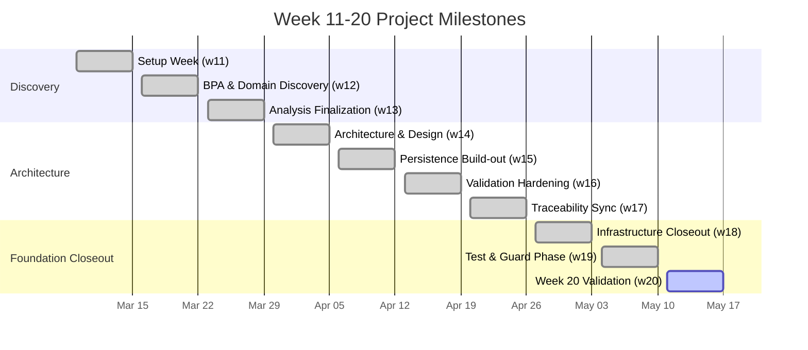

# Traceability & Logs

## Dashboard

```mermaid
gantt
	title Week 11-20 Project Milestones
	dateFormat  YYYY-MM-DD
	axisFormat  %b %d

	section Discovery
	Setup Week (w11)                :done, w11, 2026-03-09, 2026-03-15
	BPA & Domain Discovery (w12)    :done, w12, 2026-03-16, 2026-03-22
	Analysis Finalization (w13)     :done, w13, 2026-03-23, 2026-03-29

	section Architecture
	Architecture & Design (w14)     :done, w14, 2026-03-30, 2026-04-05
	Persistence Build-out (w15)     :done, w15, 2026-04-06, 2026-04-12
	Validation Hardening (w16)      :done, w16, 2026-04-13, 2026-04-19
	Traceability Sync (w17)         :done, w17, 2026-04-20, 2026-04-26

	section Foundation Closeout
	Infrastructure Closeout (w18)   :done, w18, 2026-04-27, 2026-05-03
	Test & Guard Phase (w19)        :done, w19, 2026-05-04, 2026-05-10
	Week 20 Validation (w20)       :active, w20, 2026-05-11, 2026-05-17
```

## Requirements Matrix
![[../02_analysis/requirements/requirements.base]]

## User Story Matrix
![[../02_analysis/requirements/user_stories.base]]
