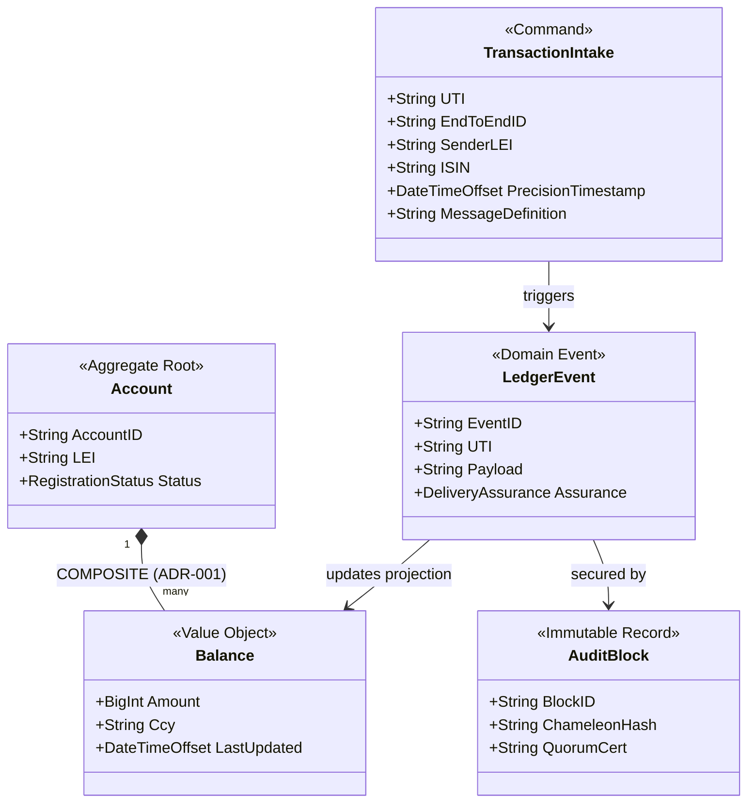
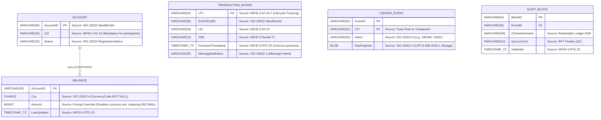

# Domain Model & ERD Synthesis (ISO 20022 & MiFID II)

## 1. Executive Summary
This document synthesizes the rigorous constraints of the **ISO 20022 Metamodel** and **MiFID II Legal Metadata** into a concrete domain and persistence architecture. It establishes the "Technical Physics" for the Ledger, translating conceptual rules (like double-entry precision and temporal fidelity) into concrete C# attributes and database schemas.

---

## 2. Domain Model Diagram (Business Logic)

The Domain Model centers on the aggregates identified in the architectural research: **Transaction** (Intake at Gateway), **Event** (The Immutable Log), and **Balance** (The Materialized Projection).

### Domain Traceability Notes:
*   **COMPOSITE Aggregation**: As per *ISO 20022-3 (ADR 001)*, a Balance cannot exist independently of an Account.
*   **RegistrationStatus**: Required by *ISO 20022-1 (RepositoryConcept)* to govern the lifecycle of entities (e.g., REGISTERED vs OBSOLETE).

---

## 3. Entity-Relationship Diagram (Storage Structure)

The ERD translates the business logic into deterministic database schema constraints, ensuring precision loss and schema corruption are structurally impossible.

---

## 4. Compliance Attributes & Data Types (C# & DB)

### 4.1 Monetary Precision (The `BigInt` Mandate)
*   **Type**: `long` (C#) / `BIGINT` (Database)
*   **Constraint**: Financial amounts MUST be tracked in the smallest possible currency unit (e.g., cents or fractional cents) to entirely eliminate floating-point rounding errors. This effectively realizes the *ISO 20022-4 DECIMAL(18,5)* scale through integer arithmetic.

### 4.2 Temporal Fidelity (MiFID II RTS 25)
*   **Type**: `DateTimeOffset` (C#) / `TIMESTAMP WITH TIME ZONE` (Database)
*   **Constraint**: All timestamps MUST include UTC offset (`Z`) and maintain 7 decimal places of precision, capturing the 1ms (standard) or 1μs (HFT) requirements defined by MiFID II Art 17.

### 4.3 Identifier Constraints
| Attribute | Length | C# Type | Database Type | Source Constraint |
| :--- | :--- | :--- | :--- | :--- |
| **UTI** | 52 | `string` | `VARCHAR(52)` | MiFID II Art 16.7 (Unique Transaction Identifier). |
| **LEI** | 20 | `string` | `VARCHAR(20)` | MiFID II Art 10 (Legal Entity Identifier). |
| **ISIN** | 12 | `string` | `VARCHAR(12)` | MiFID II Recital 71 (Instrument Identification). |
| **EndToEndID** | 35 | `string` | `VARCHAR(35)` | ISO 20022 IdentifierSet (`Max35Text`). |
| **Currency** | 3 | `string` | `CHAR(3)` | ISO 20022-4 (Ccy must be NOT NULL). |

### 4.4 Audit & Consensus Layer
*   **ChameleonHash**: A specialized hash structure stored as `VARCHAR(256)` in the `AuditBlock` to satisfy the GDPR "Right to Erasure" vs Immutability conflict (ADR requirement).
*   **QuorumCert (QC)**: A cryptographic proof of consensus finality stored as `VARCHAR(512)` to ensure audited, deterministic finality.
