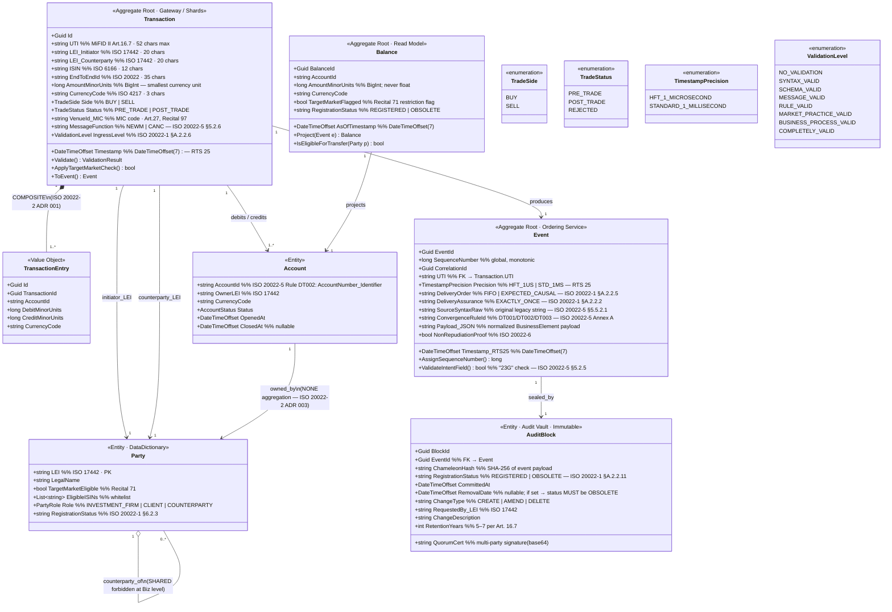
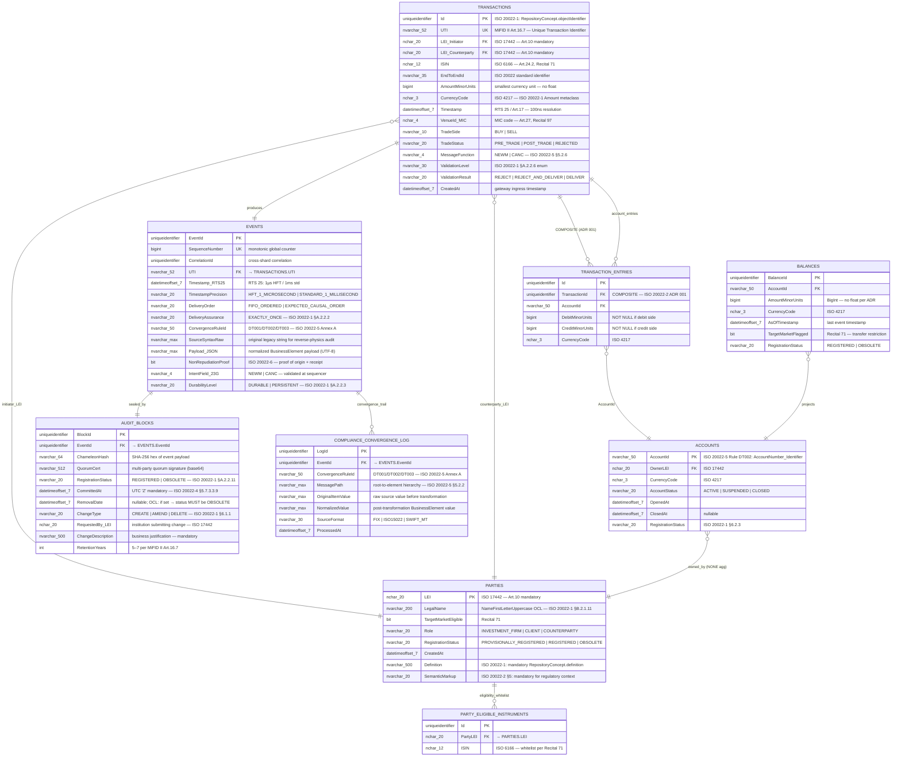

# Domain Entity Model
## ISO 20022 & MiFID II Synthesis for High-Integrity B2B Ledger

## 1. Strategic Overview

This document synthesizes the five w17 extraction files into two formal artifacts:

1. **Domain Model** — business-logic layer (aggregates, value objects, associations)
2. **Entity-Relationship Diagram** — physical storage schema for C# implementation

The architecture enforces three hard invariants derived from source material:

| Invariant | Architectural Enforcement | Primary Source |
|-----------|--------------------------|----------------|
| Legal metadata is a **consensus predicate**, not a reporting afterthought | `REJECT` at Gateway before Sequencer; Shard rejects on LEI/ISIN mismatch | MiFID II Art. 10, Recital 71; ISO 20022-1 §A.2.2.8 |
| No manual schema input — **deterministic transformation** from Repository | All schemas auto-derived; `DECIMAL(18,5)` → `BigInt` mapping enforced at ingress | ISO 20022-4 §1; ISO 20022-5 Annex A Rule DT001 |
| **Immutable, time-ordered evidence** from ingress to vault | `EXACTLY_ONCE` delivery; UTC `DateTimeOffset(7)` on every event | ISO 20022-1 §A.2.2.2; MiFID II RTS 25, Art. 16.7 |

---

## 2. Aggregate Decomposition

The ledger is structured around three **Aggregate Roots** aligned to the five-component pipeline from the MiFID II blueprint (Gateway → Sequencer → Shards → Projection → Vault).

| Aggregate       | Pipeline Stage              | ISO 20022 Anchor                                             | MiFID II Anchor                                 |
| --------------- | --------------------------- | ------------------------------------------------------------ | ----------------------------------------------- |
| **Transaction** | Gateway / Validation Shards | `BusinessComponent`, `MessageDefinition` (Part 1 §6.1.1)     | Art. 10, Art. 16.7 — mandatory LEI, UTI, ISIN   |
| **Event**       | Ordering Service            | `TransportMessage`, `MessageDeliveryOrder` (Part 1 §A.2.2.5) | RTS 25 — 1 µs / 1 ms timestamp precision        |
| **Balance**     | Balance Projection          | `BusinessElement`, `Amount` metaclass (Part 2 §3)            | Art. 27, Recital 97 — Best Execution read model |

Supporting entities: **Account**, **Party**, **AuditBlock** (Vault).

---

## 3. Domain Model — Class Diagram



---

## 4. Entity-Relationship Diagram — Physical Schema

> **Precision rules (override ISO 20022-4 DECIMAL defaults per task instruction):**
> - Money → `BIGINT` (smallest currency unit, e.g., cents for USD)
> - Timestamps → `DATETIMEOFFSET(7)` (100 ns resolution; satisfies MiFID II RTS 25 1 µs HFT requirement and ISO 8601 UTC 'Z' mandate)



---

## 5. Compliance Attribute Reference

### 5.1 Mandatory Compliance Fields per Entity

| Entity | Attribute | Format / Constraint | Source |
|--------|-----------|---------------------|--------|
| Transaction | `UTI` | `NVARCHAR(52)`, NOT NULL, UNIQUE | MiFID II Art. 16.7 |
| Transaction | `LEI_Initiator` | `NCHAR(20)`, active LEI per ISO 17442 | MiFID II Art. 10, Recital 71 |
| Transaction | `LEI_Counterparty` | `NCHAR(20)`, active LEI per ISO 17442 | MiFID II Art. 10 |
| Transaction | `ISIN` | `NCHAR(12)`, ISO 6166 | MiFID II Art. 24.2 |
| Transaction | `Timestamp` | `DATETIMEOFFSET(7)`, UTC 'Z' | MiFID II RTS 25 |
| Transaction | `VenueId_MIC` | `NCHAR(4)`, MIC code | MiFID II Art. 27, Recital 97 |
| Transaction | `TradeStatus` | `PRE_TRADE \| POST_TRADE` enum | MiFID II Art. 16.7, Recital 57 |
| Event | `TimestampPrecision` | `HFT_1_MICROSECOND` when high intraday msg rate | MiFID II Art. 17, Recital 61 |
| Event | `DeliveryAssurance` | Must be `EXACTLY_ONCE` | ISO 20022-1 §A.2.2.2 |
| Event | `DeliveryOrder` | `FIFO_ORDERED \| EXPECTED_CAUSAL_ORDER` | ISO 20022-1 §A.2.2.5 |
| Event | `ConvergenceRuleId` | One of `DT001`, `DT002`, `DT003` | ISO 20022-5 Annex A |
| AuditBlock | `ChameleonHash` | SHA-256 hex, 64 chars | Internal integrity |
| AuditBlock | `QuorumCert` | Base64 multi-party signature | Settlement finality |
| AuditBlock | `RetentionYears` | Integer 5–7, enforced TTL | MiFID II Art. 16.7 |
| AuditBlock | `RemovalDate` | If NOT NULL → `RegistrationStatus` MUST be `OBSOLETE` | ISO 20022-1 §B.2.1.11 OCL |
| Party | `TargetMarketEligible` | BIT; drives ISIN whitelist enforcement | MiFID II Recital 71 |
| Balance | `TargetMarketFlagged` | BIT; blocks transfers outside target market | MiFID II Recital 71 |

### 5.2 Data Type Precision Decisions (ADR Summary)

| Domain Concept | ISO 20022-4 Spec | **C# / DB Implementation** | Rationale |
|---------------|-----------------|---------------------------|-----------|
| Money amount | `DECIMAL(18,5)` + `CHAR(3)` | **`BIGINT` + `NCHAR(3)`** | Eliminates floating-point rounding; task mandate; settlement finality |
| Timestamp (audit) | `xs:dateTime` with 'Z' | **`DATETIMEOFFSET(7)`** | 100 ns = satisfies 1 µs HFT & 1 ms std; deterministic sequencing |
| Money (in-flight) | `xs:decimal` | **`DECIMAL(18,5)` → converted at ingress** | ISO 20022-4 §5.7.3.3.2 facets: `totalDigits:18`, `fractionDigits:5` |
| Currency code | `xs:restriction string` | **`NCHAR(3)` NOT NULL** | ISO 4217; `ActiveCurrencyAndAmount.Ccy` constraint |
| Max35Text | `VARCHAR(35)` | **`NVARCHAR(35)`** | ISO 20022-4 §5.7.3.3.4; buffer overflow prevention |
| Binary content | `xs:base64Binary` | **`VARBINARY(MAX)`** | ISO 20022-4 §5.7.3.3 |
| Inter-shard transport | XML | **ASN.1 Aligned PER** | ISO 20022-8 — max throughput; syntactical equiv. with XSD |

### 5.3 Gateway Validation Sequence (8-Level Checklist)

All ingress messages must pass levels in order per ISO 20022-1 §A.2.2.6:

```
1. SYNTAX_VALID          → well-formed XML/JSON; UTF-8 encoding; DOCTYPE prohibited (XXE)
2. SCHEMA_VALID          → XSD / JSON Schema; namespace = urn:iso:std:iso:20022:tech:xsd:[ID]
3. MESSAGE_VALID         → internal MessageRules; UTI / LEI / ISIN present and non-empty
4. RULE_VALID            → global BusinessRules; LEI active in registry; ISIN in DataDictionary
5. MARKET_PRACTICE_VALID → Target Market whitelist check (Recital 71)
6. BUSINESS_PROCESS_VALID → MessageChoreography conformance; NEWM/CANC flow consistency
7. COMPLETELY_VALID      → all rules simultaneously; only then emit to Sequencer
   └─ REJECT policy default; REJECT_AND_DELIVER only if shard handles own exceptions
```

### 5.4 Out-of-Scope Entities (MiFID II Art. 2 Exceptions)

The following are explicitly excluded from the domain model per the MiFID II blueprint:

| Exclusion | MiFID II Reference |
|-----------|-------------------|
| ESCB / central bank operations | Art. 2.1(h) |
| Energy Transmission System Operators | Art. 2.1(n) |
| Retail insurance products | Recitals 87, 89 |

---

## 6. Traceability Matrix

| Domain Entity / Attribute | ISO 20022 Source | MiFID II Source |
|--------------------------|-----------------|-----------------|
| `Transaction` aggregate | Part 1 §6.1.1 `BusinessComponent`; Part 2 §2 ERD anchor | Art. 10, Art. 16.7 |
| `Transaction.UTI` | Part 1 §3.49 `MessageDefinitionIdentifier` | Art. 16.7 — lifecycle tracking |
| `Transaction.LEI_*` | Part 1 `IdentifierSet` B.2.1.8 — URI scheme | Art. 10, ISO 17442 |
| `Transaction.ISIN` | Part 1 `CodeSet` B.2.1.5 — enumerated domain | Art. 24.2, Recital 71 |
| `Transaction.EndToEndId` | Part 5 §1 `MessagePath` → `Command.Payload.Address` | — |
| `Transaction.ValidationLevel` | Part 1 §A.2.2.6 — 8-level enum | — |
| `Transaction.AmountMinorUnits` | Part 1 `Amount` B.2.7.1; Part 4 §5.7.3.3.2 `totalDigits:18` | — |
| `Event` aggregate | Part 1 `TransportMessage` B.2.4.6; Part 4/5 Sequencer NFRs | RTS 25 clock sync |
| `Event.SequenceNumber` | Part 1 `MessageDeliveryOrder` §A.2.2.5 | — |
| `Event.Timestamp_RTS25` | Part 4 §5.7.3.3.9 `xs:dateTime` UTC 'Z' | RTS 25, Art. 17, Recital 61 |
| `Event.TimestampPrecision` | — | RTS 25: 1 µs HFT / 1 ms std |
| `Event.DeliveryAssurance` | Part 1 §A.2.2.2 `EXACTLY_ONCE` | — |
| `Event.DeliveryOrder` | Part 1 §A.2.2.5 `EXPECTED_CAUSAL_ORDER` | — |
| `Event.ConvergenceRuleId` | Part 5 Annex A Rules DT001–DT003 | — |
| `Event.SourceSyntaxRaw` | Part 5 §5.5.2.1 independent verification | — |
| `Balance` aggregate | Part 1 `Amount` metaclass; Part 2 §3 read model | Art. 27, Recital 97 |
| `Balance.TargetMarketFlagged` | — | Recital 71, Recital 108 |
| `Account.AccountId` | Part 5 Rule DT002 `AccountNumber_Identifier` | — |
| `Party.LEI` | Part 1 `IdentifierSet` ISO 17442 | Art. 10, Recital 71 |
| `Party.RegistrationStatus` | Part 1 §6.2.3, §A.2.2.11 lifecycle enum | — |
| `Party.TargetMarketEligible` | — | Recital 71 Target Market |
| `AuditBlock.ChameleonHash` | Part 1 `Trace` B.2.1.14 — physical → logical mapping | — |
| `AuditBlock.QuorumCert` | Part 6 Non-repudiation; Part 1 `DeliveryAssurance` | Art. 16.7 |
| `AuditBlock.RegistrationStatus` | Part 1 §A.2.2.11 OCL: `removalDate` → `OBSOLETE` | — |
| `AuditBlock.RetentionYears` | Part 1 Change History Record §6.1.1 | Art. 16.7 — 5–7 year TTL |
| `COMPLIANCE_CONVERGENCE_LOG` | Part 5 §5.5.2 convergence documentation | — |
| UTF-8 encoding (all tables) | Part 4 §5.5.1 — absolute ingress requirement | — |
| DOCTYPE prohibition | Part 4 §5.5.2 — XXE mitigation | — |
| `NameFirstLetterUppercase` OCL | Part 1 §B.2.1.11 — all entity names [A-Z] first char | — |
| COMPOSITE aggregation (Account ↔ Balance) | Part 2 ADR 001 §6.2.1 | — |
| SHARED aggregation **forbidden** at Biz level | Part 2 ADR 003 §A.2.5.3 | — |
| ASN.1 Aligned PER (inter-shard) | Part 8 §5.8.2 — `SEQUENCE` mapping | — |
