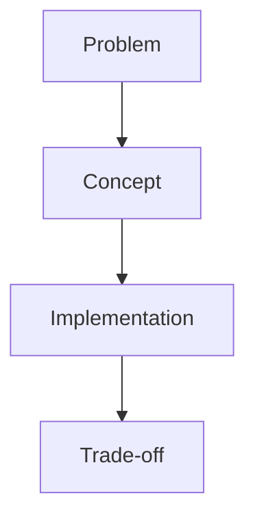

# Lesson [NN]: [Topic]

## Objective
[What this lesson teaches in one paragraph.]

## Why It Matters for the Ledger
- [Reason 1]
- [Reason 2]

## Key Concepts
- [Concept A]
- [Concept B]
- [Concept C]

## Mental Model (Mermaid)

## Applied Example (.NET 10 / C# 14)
[Short, practical example tied to this project.]

## Common Pitfalls
- [Pitfall 1]
- [Pitfall 2]

## Interview Notes
- [How to explain this concept in an interview]

## Sources
- [Source URL or internal note]

## TODO to Internalize
- [ ] Rewrite from memory
- [ ] Apply in project code
- [ ] Explain to Gemini/Copilot in your own words
