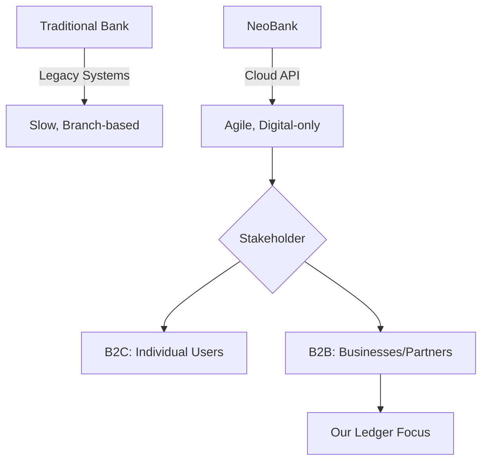

---
source:
  - Plaid.com | Investopedia | BIS | Stripe.com
phase: fundamentals
status: draft
last-updated: 2026-03-30
applied-in-project: yes
---

# Lesson 01: The Neobank & B2B Context

## Objective
Understand the business environment where our Ledger operates. We define what a **Neobank** is, how **B2B** (Business-to-Business) interactions differ from personal banking, and the role of a digital-first financial platform.

## Why It Matters for the Ledger
- **Scale**: B2B transactions are often large-volume or high-value, requiring the performance we researched in Batch 03.
- **Complexity**: Business accounts involve payroll, expense management, and vendor payouts, not just simple transfers.
- **Regulatory pressure**: B2B platforms must comply with strict audit and AML (Anti-Money Laundering) rules (ISO 20022).

## Key Concepts

### 1. What is a Neobank?
A **Neobank** (also called a "Challenger Bank") is a financial institution that exists **only digitally**. 
- No physical branches.
- Built on modern cloud infrastructure (not legacy mainframes).
- Often partners with a traditional "Chartered Bank" to hold the actual money (Federal insurance/compliance).

### 2. What is B2B (Business-to-Business)?
In this project, the "client" is not an individual person buying coffee; it is **another company**.
- **Use Case**: A company uses our NeoBank to pay 500 employees (Payroll) or 50 vendors (Accounts Payable).
- **Difference**: B2B requires **Mass Payouts**, **Invoice Financing**, and **Integrated Accounting** (connecting the ledger to software like QuickBooks or SAP).

### 3. The Digital-First Advantage
Traditional banks are like "Ocean Liners" (slow to turn, heavy legacy gear). Neobanks are like "Speedboats" (agile, API-driven, and capable of real-time processing).

## Mental Model

## Applied Example (B2B Scenario)
Imagine a construction company (**Company A**) using our Ledger.
1. **Event**: Company A pays a subcontractor ($10,000).
2. **Ledger Role**: The ledger doesn't just "move money"; it records the **Contract ID**, the **Vendor ID**, and the **Tax Reference** in an immutable log.
3. **Outcome**: The subcontractor gets paid instantly, and the accounting software is updated via API.

## Common Pitfalls
- **Thinking of B2C**: Don't assume the UI or Logic is for a single app user. B2B is about **Integrations** and **Bulk Operations**.
- **Ignoring the Partner Bank**: Most neobanks "front" the service but rely on a legacy bank for the actual "vault." Our ledger must sync with these external partners.

## Interview Notes
- **Definition**: A Neobank is a digital-only fintech using APIs to deliver financial services without branches.
- **B2B vs B2C**: B2C is volume-driven (millions of users); B2B is value/process-driven (API integrations, payroll, automated treasury).

## Sources
- [Plaid: What is a Neobank?](https://plaid.com/resources/fintech/what-is-a-neobank/)
- [Investopedia. Online vs. Traditional Banks: Benefits and Downsides](https://www.investopedia.com/articles/pf/11/benefits-and-drawbacks-of-internet-banks.asp)
- [The Evolution of Banking: From Temples to Digital Platforms](https://www.investopedia.com/articles/07/banking.asp)
- [Stripe: B2B Payment Automation Guide](https://stripe.com/resources/more/b2b-payments-explained-best-practices-and-how-stripe-can-help)

## TODO to Internalize
- [ ] Research one B2B Neobank (e.g., Rho, Brex, or Qonto) to see their "Features" page.
- [ ] Explain the difference between "Digital Banking" and a "Neobank" in your own words.
- [ ] Identify one "Mechatronic" system that acts like a B2B platform (e.g., a Factory Controller managing multiple Sub-PLC units).
