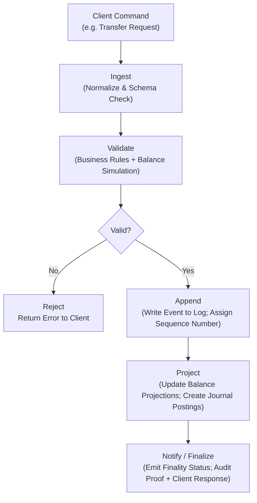
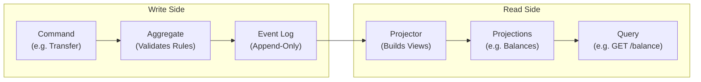

# Lesson 02: Ledger Fundamentals (Event Log vs. World State)

## Objective
Distinguish between the History (the immutable Event Log) and the Current Reality (the World State / materialized view). This distinction is the foundation of Event Sourcing for ledger systems.

## Why It Matters for the Ledger
- **Auditability**: Events record the full narrative of how state changed.
- **Recovery**: Replaying events deterministically rebuilds state after failure.
- **Integrity**: Immutable events provide tamper-evidence and provable history.

---

## Definitions

| Term | Definition |
|---|---|
| **Event** | An immutable record describing something that happened (e.g., `Deposit`, `Transfer`, `Reversal`). |
| **Command** | A request to do something (e.g., `RequestTransfer`). It produces an Event if valid. |
| **Projection / World State** | A materialized view derived by applying events in order (e.g., current account balances). |
| **Aggregate** | A domain entity (e.g., `Account`) that enforces business rules when processing commands. |
| **Snapshot** | A periodic capture of the World State to speed up recovery without replaying all history. |
| **Append-only** | Events are only inserted, never modified. Corrections use compensating events. |
| **Idempotency Key** | A unique ID on a command so that retrying it never produces duplicate effects. |

---

## Key Concepts

### 1. The Append-Only Log (The "Truth")
Instead of updating a balance directly, you record the **intent** as an event.

| Approach | What happens in the database |
|---|---|
| **CRUD** | `UPDATE account SET balance = 150` — history is destroyed |
| **Event Sourcing** | `INSERT event (Deposit, +50)` — history is preserved |

Property: **immutability** — once appended, an event is a permanent part of the official history. You cannot delete it; you can only add a compensating event (e.g., a `Reversal`).

#### Event Schema (example)
```json
{
  "id": "evt-0001",
  "type": "Transfer",
  "from": "acct:A",
  "to": "acct:B",
  "amount": 10000,
  "currency": "USD",
  "timestamp": "2026-03-31T10:00:00Z",
  "metadata": { "contractId": "C-1234", "vendorId": "V-987" },
  "idempotencyKey": "cmd-abc-123"
}
```
> **Always use integer minor units** (e.g., cents, not dollars with decimals). Floating-point arithmetic is non-deterministic and will corrupt a ledger.

---

### 2. The World State (The "View")
The World State is **derived** from the log:
```
CurrentState = InitialState + Σ(all events in order)
```

- Materialized views support low-latency queries (e.g., "Does this account
  have enough funds right now?").
- Use **Snapshots** to avoid replaying the entire history on every recovery.
  Instead: `Snapshot(at T) + Σ(events after T) = CurrentState`.

---

### 3. Processing Pipeline: ingest → validate → append → project


| Step         | What happens                                                    | Key concern                             |
| ------------ | --------------------------------------------------------------- | --------------------------------------- |
| **Ingest**   | Receive command via API, normalize payload, check schema        | Malformed input                         |
| **Validate** | Business rules, balance simulation, anti-fraud checks           | Insufficient funds, duplicate detection |
| **Append**   | Persist event atomically; sequencer assigns order               | Ordering, concurrency                   |
| **Project**  | Apply event to read models; update balances and journal entries | Eventual consistency                    |
| **Notify**   | Emit finality status, audit proof, client response              | At-least-once delivery                  |

---

### 4. CQRS: Separating Writes from Reads

**CQRS (Command Query Responsibility Segregation)** is the pattern that naturally pairs with Event Sourcing. The idea is simple:
- The **Write Side (Command)** receives commands, validates them, and appends events to the log.
- The **Read Side (Query)** serves balance lookups and reports from pre-computed projections.


Why does this matter for your project? Your .NET API will have separate **Command Handlers** and **Query Handlers** — this is the architecture CQRS describes. Libraries like **MediatR** in .NET implement this pattern.

---

### 5. Event Sourcing vs. CRUD — Full Comparison

| Dimension | CRUD | Event Sourcing |
|---|---|---|
| Storage | Current state only | Full history of events |
| Audit trail | Requires extra logging | Built-in (the log IS the truth) |
| Recovery after failure | Restore last backup | Replay events from log (or snapshot) |
| Temporal queries | Hard ("what was the balance on Jan 1?") | Easy (replay up to that date) |
| Complexity | Low | Higher (projection management, schema evolution) |
| Regulatory fit | Weak | Strong (immutability + full history) |

---

## Mapping to Double-Entry Accounting

A single `Transfer` event produces balanced journal **postings**:
```json
{
  "eventId": "evt-0001",
  "postings": [
    { "account": "acct:A", "debit": 10000, "credit": 0,     "currency": "USD" },
    { "account": "acct:B", "debit": 0,     "credit": 10000, "currency": "USD" }
  ]
}
```

The ledger enforces **atomicity**: the sum of debits must always equal the sum of credits. This is the "physics" of money — value is conserved, not created or destroyed. (Lesson 03 will cover this in depth.)

---

## Trade-offs and Mitigations

| Challenge | Mitigation |
|---|---|
| Storage growth | Snapshots, compaction, retention policies |
| Slow recovery | Tune snapshot frequency to meet RTO targets |
| Schema evolution | Version event schemas; provide migration tooling |
| GDPR vs immutability | Use reversal/compensating events; plan redactable-ledger ADRs |
| Concurrency anomalies | Use MVCC or a sequencer/orderer service |

---

## Common Pitfalls
- Updating state **without** an event — breaks the source of truth.
- Using **floating-point** for monetary amounts — use integer minor units.
- Missing **idempotency keys** — leads to duplicate transactions on retry.
- Ignoring **partner-bank reconciliation** — cross-ledger mapping must be explicitly modeled.
- Confusing a **Command** with an **Event** — a Command is a request that *might* be rejected; an Event is a fact that *already happened*.

---

## Mental Model: The Mechatronics Analogy

| Ledger concept | Mechatronics equivalent |
|---|---|
| Event Log | G-Code instruction list (the program) |
| World State | Current machine position (X, Y, Z) |
| Snapshot | Homing / known reference position |
| Replay | Re-running the G-Code from a reference point |
| Compensating Event | A correction move (G-Code line that undoes a previous one) |

After a power loss, you don't guess the machine's position — you either home it (full replay) or restore from a reference snapshot and continue. The ledger works exactly the same way.

---

## Applied Example: Payroll at a Construction Company

**Company A** (100 employees) runs payroll through our Neobank Ledger.

1. **Command**: `RunPayroll` for 100 employees, total $250,000.
2. **Ingest**: API receives the batch command with an `idempotencyKey`.
3. **Validate**: Check that Company A's operating account has ≥ $250,000.
4. **Append**: One `PayrollBatch` event is written to the log with all 100 employee entries and metadata (`payrollRunId`, `periodEnd`).
5. **Project**: 101 balance projections are updated (1 debit from Company A, 100 credits to employees). Journal postings are created.
6. **Notify**: Each employee's account receives a finality confirmation. Accounting software (QuickBooks/SAP) is updated via webhook.

**What if the network fails after step 4?** The event is already in the log. On retry, the `idempotencyKey` prevents a duplicate — the system detects the event was already appended and returns the original result.

---

## Operational Checklist
- [ ] Use integers for monetary amounts (cents, not dollars).
- [ ] Include `idempotencyKey` on all commands.
- [ ] Record `contractId`, `vendorId`, and metadata for auditability.
- [ ] Set snapshot cadence based on TPS and acceptable RTO.
- [ ] Version all event schemas from day one.

---

## Interview Notes
- **Event Sourcing**: immutable events are the source of truth; projections are derived read models that can be rebuilt at any time.
- **Snapshotting** speeds recovery; never delete events — use reversal events.
- **CQRS** separates Command (write) and Query (read) responsibilities; in .NET, MediatR is the standard library for this pattern.
- **Why not CRUD for a ledger?** Regulators require an audit trail. CRUD destroys history; Event Sourcing preserves it by design.

---

## Sources
- [[fulbier_2023|Fülbier & Sellhorn, 2023]] — context on double-entry and financial reporting.
- [[kahmann_2023|Kahmann et al., 2023]] — performance contrasts (DAG vs. blockchain).
- [[wu_2026|Wu et al., 2026]] — conflict-aware ordering (cited in meta-analysis).


---

## TODO to Internalize
- [ ] On paper: draw the pipeline diagram (ingest → validate → append → project → notify) for a `Deposit` command.
- [ ] Explain why `amount: 100.50` is dangerous and `amount: 10050` is safe.
- [ ] Explain CQRS in one sentence and name the .NET library that implements it.
- [ ] Diagram a `Transfer` event producing two journal postings.
- [ ] Explain why deleting a transaction is impossible in a compliant ledger — describe what a "Reversal Event" does instead.
- [ ] Research: what is an acceptable RTO for a fintech ledger? How does snapshot frequency affect it?