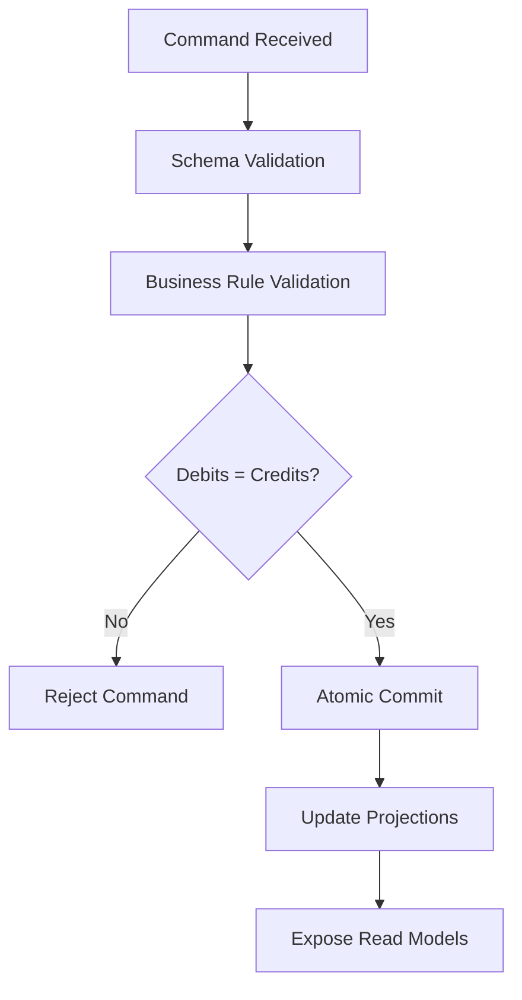

---
source:
  - Fülbier & Sellhorn (2023) | Huang et al. (2024) | Mashiko et al. (2025)
phase: fundamentals
status: draft
last-updated: 2026-03-31
applied-in-project: yes
---

# Lesson 03: Double-Entry "Physics" (Mathematical Integrity)

## Objective
Master the non-negotiable conservation law of accounting: every accepted transaction must keep the ledger balanced. In this project, double-entry is treated as a hard system invariant, not an optional business rule.

## Why It Matters for the Ledger
- **Conservation of value**: Value moves between accounts; it is not created or destroyed by bookkeeping.
- **Early failure**: If Debits != Credits, the transaction must be rejected before commit.
- **Auditability**: Balanced postings allow deterministic reconstruction and explainable proofs.
- **Safety in scale**: In high-volume B2B flows, tiny arithmetic inconsistencies accumulate into material financial risk.

---

## Definitions

| Term | Definition |
| --- | --- |
| **Debit (DR)** | Posting on the debit side of an account entry. Effect depends on account type. |
| **Credit (CR)** | Posting on the credit side of an account entry. Effect depends on account type. |
| **Journal Entry** | Atomic set of postings produced by one business event. |
| **Posting** | One line in a journal entry: account, amount, side (DR/CR), currency, metadata. |
| **Balanced Transaction** | A transaction where total debits equal total credits in the same currency scope. |
| **Accounting Equation** | $Assets = Liabilities + Equity$. Ledger state must preserve this identity after every commit. |
| **Atomicity** | All postings of the event are committed together or none are committed. |
| **Minor Units** | Integer smallest currency unit (e.g., USD cents). Avoids floating-point drift. |
| **FX Conversion** | A ledger event that converts value from one currency to another using an explicit exchange rate, rounding policy, and metadata so both sides remain auditable and balanced. |
| **Trial Balance** | Aggregate check of account balances to verify systemic DR/CR consistency. |

---

## Key Concepts

### 1. The Dual-Entry Axiom
Every valid transaction generates at least two postings (one debit, one credit).

Core invariant per transaction:
$$
\sum Debits - \sum Credits = 0
$$

If this is false at validation time, the transaction is invalid and must not be appended.

### 2. The Accounting Equation
$$
Assets = Liabilities + Equity
$$

This is the system-level invariant. Transaction-level DR/CR balancing is the mechanism that preserves it over time.

Interpretation for engineering:
- A command is valid only if its resulting postings maintain per-transaction balance.
- The projection layer must never expose a state violating the equation.

### 3. Integer Precision (The "No Float" Rule)
Never use `float`/`double` for monetary persistence or balance logic.

Why:
- Binary floating-point cannot exactly represent many decimal fractions.
- Non-determinism breaks reconciliation and replay guarantees.

Rule:
- Persist amounts as integers in minor units.
- Include currency and scale in metadata.
- In C# business logic, `decimal` can be useful for calculations, but ledger persistence and replay should still use integer minor units (`long`) so the stored history remains deterministic.

Example:
- $100.50 USD => `10050` (cents).

### 4. Currency Scope and Rounding Discipline
Balance checks are currency-scoped:
- Do not offset USD debits with EUR credits in the same equality check.
- FX conversions must be explicit events with rate metadata and rounding policy.

Rounding discipline:
- Define where rounding occurs (pricing, tax, FX conversion).
- Use deterministic bankers' rounding (or documented alternative) consistently.

### 5. CQRS Placement
Double-entry validation belongs on the **write side**: commands are validated, balanced, and committed there. The **read side** only consumes committed postings to build balances, reports, and audit views.

---

## Validation Pipeline (for Double-Entry Safety)
1. **Schema validation**: account ids, currency, amount > 0, metadata present.
2. **Business rule validation**: account status, limits, authorization.
3. **Balance validation**: per-currency $\sum DR = \sum CR$.
4. **Atomic commit**: append event and postings in one transactional boundary.
5. **Projection update**: update balances/read models from committed postings only.



---

## Mental Model: The Mechatronics Bridge
To connect this lesson to your engineering background:
- **The journal entry** is the machine command sequence.
- **The balance check** is the interlock that prevents unsafe motion.
- **The projection/read model** is the sensor panel that reports the current machine state.
- **The write side** is the controller that enforces invariants before actuation.
- **The read side** is the monitoring system that observes committed state only.

## Applied Examples

### Example A: Simple Transfer
Scenario: Company A pays Company B $500.00 (USD).

Minor units: `50000`.

| Account | Debit (DR) | Credit (CR) |
| --- | --- | --- |
| `Cash:CompanyB` | 50000 | 0 |
| `Cash:CompanyA` | 0 | 50000 |
| **Total** | **50000** | **50000** |

Result: balanced, valid for commit.

### Example B: Payment with Fee
Scenario: Company A pays Vendor B $100.00 with a $2.00 processing fee.

Minor units: `10000` and `200`.

| Account                  | Debit (DR) | Credit (CR) |
| ------------------------ | ---------- | ----------- |
| `Expense:VendorPurchase` | 10000      | 0           |
| `Expense:ProcessingFees` | 200        | 0           |
| `Cash:CompanyA`          | 0          | 10200       |
| **Total**                | **10200**  | **10200**   |

Result: still balanced, with economics made explicit.

### Journal Entry Shape (example)
```json
{
  "journalEntryId": "je-2026-04-01-001",
  "eventId": "evt-0201",
  "currency": "USD",
  "postings": [
    { "account": "Expense:VendorPurchase", "debit": 10000, "credit": 0 },
    { "account": "Expense:ProcessingFees", "debit": 200, "credit": 0 },
    { "account": "Cash:CompanyA", "debit": 0, "credit": 10200 }
  ],
  "checksum": "sumDrEqSumCr"
}
```


In common language:

- "Debit" = money leaving your account (bad)
- "Credit" = money arriving (good)

In accounting, **it depends on the account type**:

|Account Type|Debit effect|Credit effect|
|---|---|---|
|**Asset** (e.g. Cash)|⬆ Increases|⬇ Decreases|
|**Liability** (e.g. Loan)|⬇ Decreases|⬆ Increases|
|**Expense** (e.g. Fees)|⬆ Increases|⬇ Decreases|
|**Revenue** (e.g. Fees earned)|⬇ Decreases|⬆ Increases|

So when the lesson wrote `Cash:CompanyA` on the **Credit side**, it means Company A's cash **decreased** — which is correct, they paid $102.

---

## Common Pitfalls
- **One-sided updates**: mutating one account balance without counter-posting.
- **Implicit FX**: mixing currencies without explicit conversion entries.
- **Floating point arithmetic**: causing non-reproducible balances.
- **Non-atomic write paths**: event appended but postings missing (or vice versa).
- **Late validation**: checking balance after projection instead of before commit.

---

## Operational Checklist
- Use integer minor units (`long`) for persisted monetary values.
- Enforce per-currency balance invariant at write time.
- Commit event + postings atomically.
- Attach audit metadata (eventId, correlationId, actor, timestamp).
- Reject invalid commands; do not auto-correct by hidden mutations.

## Interview Notes
- **Double-entry is a safety invariant**, not just an accounting convention.
- **Atomicity + balance validation** are both required; either alone is insufficient.
- **Integer arithmetic** is foundational for replayable, deterministic ledgers.
- **Balanced does not mean authorized**: still enforce limits, policy, and compliance.
- **Accounting equation interview prompt**: if a transfer moves cash from Company A to Company B, the ledger changes composition, not total value. Assets, liabilities, or equity may move between accounts, but the equation must remain balanced after the transaction.

## Sources
- [[fulbier_2023|Fülbier & Sellhorn, 2023]]: Double-entry as the core language of business reporting.
- [[huang_2024|Huang et al., 2024]]: Precision and system constraints in high-throughput ledger settings.
- [[mashiko_2025|Mashiko et al., 2025]]: Integrity and formal safety framing for financial ledger logic.

## TODO to Internalize
- [ ] Write a small validation function that rejects unbalanced journal entries.
- [ ] Model a 3-posting payment + fee transaction and prove $\sum DR = \sum CR$.
- [ ] Explain how integer minor units prevent reconciliation drift.
- [ ] Design one FX conversion event with explicit rate and rounding metadata.
