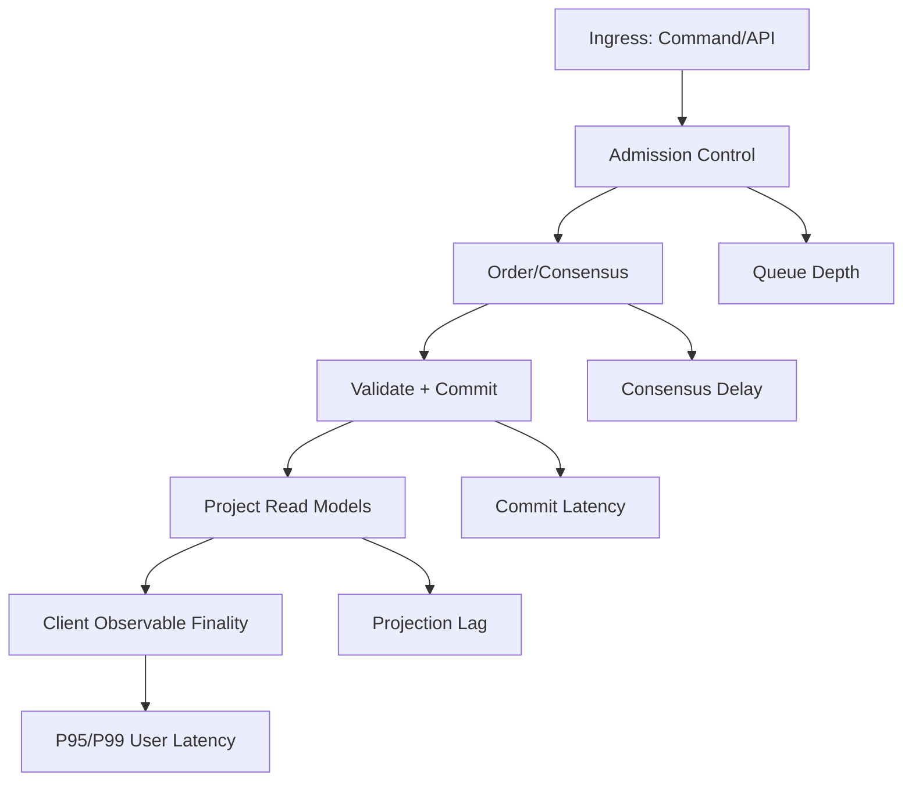

---
source:
  - Al-Bassam (2018) | Sonnino (2021) | Barger (2021) | Guggenberger (2022)
phase: performance
status: draft
last-updated: 2026-03-31
applied-in-project: yes
---

# Lesson 04: Performance Anchors (Benchmarks & Limits)

## Objective
Understand the measurable limits of a B2B ledger and translate benchmark numbers into realistic architecture decisions. In this lesson, performance is treated as an SLO/SLA engineering discipline, not as marketing claims.

## Why It Matters for the Ledger
- **Capacity planning**: Payroll, payout, and settlement windows create burst workloads.
- **Correct target setting**: LAN lab results and WAN production results are fundamentally different.
- **Architecture choice**: Consensus protocol, storage engine, and topology determine observed TPS/latency.
- **Risk control**: Without explicit anchors, systems pass tests but fail under real contention.

---

## Definitions

| Term | Definition |
| --- | --- |
| **TPS** | Transactions Per Second: sustained number of committed transactions per second under a declared workload profile. |
| **Latency** | End-to-end time from accepted command to committed/final result observable by client. |
| **P50 / P95 / P99** | Percentiles for latency distribution; P99 captures tail behavior under stress. |
| **Finality** | Point at which a transaction is irreversible under the chosen consensus model. |
| **Throughput Ceiling** | Maximum sustainable TPS before queue growth, timeout spikes, or instability begins. |
| **Backpressure** | Mechanism that slows intake when processing is saturated to protect correctness. |
| **SLO** | Service Level Objective: internal target (e.g., P95 latency < 200 ms in LAN). |
| **SLA** | External promise to users/contracts, typically less strict than SLO safety margin. |
| **RTO** | Recovery Time Objective: max acceptable restoration time after outage. |

---

## Key Concepts

### 1. Throughput Is a Workload Property, Not a Constant
TPS depends on:
- transaction shape (simple transfer vs multi-posting operations),
- contention profile (hot accounts vs uniform distribution),
- consistency/finality model,
- storage + network conditions.

Interpretation:
- A quoted TPS is meaningful only with test context (nodes, hardware, network, payload).

### 2. Latency Has a Distribution
Do not plan with average latency only.

Track at least:
- P50 (typical)
- P95 (operational target)
- P99 (tail risk)

In payments, tail latency usually drives incident volume and user trust loss.

### 3. Consensus and Topology Penalty
As validator count and geographic spread increase:
- coordination overhead rises,
- message fan-out grows,
- latency tails widen.

Practical effect:
- Systems become network-bound before CPU-bound at larger node counts in many BFT settings.

### 4. Storage Path Matters
For append-heavy workloads:
- write-optimized KV paths often outperform document-style paths,
- projection/update design can dominate end-to-end latency,
- compaction/checkpoint policy directly affects stability under sustained load.

### 5. Architecture Placement (Write Side vs Read Side)
Performance controls are not isolated to one module:
- **Write side**: admission control, ordering, validation, commit latency, and conflict handling determine finality throughput.
- **Read side**: projection lag, query index strategy, and cache invalidation determine read latency.
- **Bridge metric**: end-to-end user latency depends on both commit path and projection freshness.

---

## Performance Anchors (How to Read Them)

| Profile | Indicative TPS | Indicative Latency | Source/Context | Interpretation |
| --- | --- | --- | --- | --- |
| **Apex protocol benchmark** | up to 160,000 | sub-100 ms (controlled context) | FastPay-style RTGS benchmark | Upper-bound reference, not default production expectation. |
| **BFT consortium baseline (LAN)** | around 2,500 | around 100-200 ms | BFT permissioned consortium | Practical architecture anchor for enterprise permissioned setups. |
| **WAN production baseline** | above 1,000 | around 1.2-1.5 s | Cross-region WAN production | Realistic cross-region operating regime with network constraints. |

Planning takeaway:
- Choose targets by business window and topology, not by maximal published number.

---

## Mental Model: Mechatronics Bridge

| Ledger Performance Concept | Mechatronics Analogy | What to Watch |
| --- | --- | --- |
| **TPS** | Parts processed per minute on a production cell | Stable sustained output under real load |
| **Latency** | Time from start signal to finished part ejection | Cycle time distribution, not only average |
| **Consensus delay** | Safety interlock/PLC handshake before motion | Coordination overhead as stations increase |
| **Backpressure** | Feed-rate governor to avoid jams | Queue depth and timeout growth |
| **Projection lag** | HMI/dashboard refresh delay after actuation | Control panel can be stale if pipeline is congested |

---

## Capacity Math (Quick Domain Approximation)

Daily capacity estimate:
$$
DailyTx \approx TPS \times 86{,}400
$$

Examples:
- 1,000 TPS -> about 86.4 million tx/day
- 2,500 TPS -> about 216 million tx/day

Use this only as first-pass sizing; real capacity is lower under contention and policy checks.

---

## Applied Scenario: Payroll Burst Window
Scenario:
- 500 companies submit payroll files in a 20-minute window.
- Average 2,000 transactions per company.

Required gross throughput:
$$
\frac{500 \times 2{,}000}{1{,}200s} \approx 833\ TPS
$$

Engineering implication:
- A 1,000 TPS WAN baseline may pass, but little headroom remains for retries/spikes.
- You need admission control, queueing policy, and backpressure to preserve finality latency.

### Correctness Under Load
Every one of those 833 TPS still has to pass the Lesson 03 validation pipeline before commit, including schema checks, business-rule checks, and balance validation with $DR = CR$. High throughput does not relax the double-entry invariant; it only increases the pressure on the system to enforce it consistently. That is why admission control and backpressure exist: to protect correctness first, and latency second. If the system cannot validate safely, it should slow down or reject work rather than admit unbalanced or stale transactions.

---

## Common Pitfalls
- **Benchmark cherry-picking**: quoting peak TPS without topology/workload context.
- **Average-only monitoring**: ignoring P95/P99 tails.
- **No contention modeling**: tests with random keys but production has hot accounts.
- **Ignoring storage compaction effects**: latency spikes after long uptime.
- **No backpressure**: intake exceeds processing and causes cascading timeouts.

---

## Operational Checklist
- Define SLOs by topology: LAN and WAN separately.
- Track P50/P95/P99 and error rate together.
- Run load tests with contention patterns that match business reality.
- Keep a throughput headroom policy (for example, 30% reserve under peak windows).
- Validate RTO and replay speed under production-like data volume.

## Interview Notes
- **Fast is multidimensional**: throughput, latency distribution, and finality confidence.
- **Performance claims need context**: node count, workload shape, hardware, and network.
- **Enterprise reliability prefers predictable tails** over headline peak TPS.
- **SLO first, benchmark second**: architecture should satisfy business windows and compliance obligations.
- **Practical interview prompt**: if TPS is high but projection lag grows, is the system really "fast" for users? Explain using write-path vs read-path metrics.

## Sources
- [[al_bassam_2018|Al-Bassam, 2018]]: Throughput/latency behavior in high-performance consensus contexts.
- [[sonnino_2021|Sonnino, 2021]]: RTGS-style high-throughput benchmark references.
- [[barger_2021|Barger, 2021]]: Production-oriented BFT baseline anchors.
- [[guggenberger_2022|Guggenberger, 2022]]: WAN behavior and storage-path effects.

## TODO to Internalize
- [ ] Compute required TPS for one payroll burst scenario from your target customer profile.
- [ ] Define one SLO set (P95 latency + error budget) for LAN and WAN separately.
- [ ] Explain a case where peak TPS improved but user-perceived performance got worse.
- [ ] Design a minimal dashboard: TPS, P95/P99 latency, queue depth, timeout rate, replay lag.
