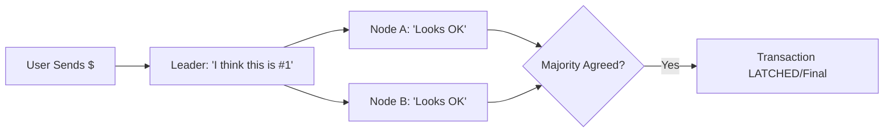

# Lesson 05: Distributed Consensus (The "Agreement" Problem)

## Objective
Understand how multiple computers (Nodes) agree on a single truth without a central boss. We will learn why "Ordering" is the most important job in a ledger.

## Why It Matters for the Ledger
- **No Single Point of Failure**: If one computer crashes, the ledger keeps running.
- **Trust**: We don't need to trust one "Server Owner"; we trust the mathematical agreement between many.
- **Double-Spend Prevention**: Consensus ensures that if you have $100, you can't pay two different people $100 at the same time.

## Key Concepts

### 1. The "Furnace" Problem (Consensus Analogy)
Imagine a factory furnace with 3 temperature sensors:
- Sensor A: 450°C
- Sensor B: 452°C
- Sensor C: 300°C (It's broken!)

How does the controller decide the "True" temperature? 
- It can't just pick one. It needs a **Consensus Algorithm** (like a "Majority Vote" or "Median Filter") to ignore the broken sensor and agree on ~451°C.

### 2. Ordering: Who was first?
In a neobank, if you have $10 and you try to buy a $10 book and a $10 coffee at the exact same millisecond, the computers must agree: **Which one happened first?** 
- Consensus is basically a **Global Sequencer** (like a conveyor belt that puts boxes in a single line).

### 3. The "Nodes" (The Agents)
- **Leader**: The computer currently "in charge" of suggesting the order.
- **Validators**: The other computers that check the Leader's work.
- **Finality**: The moment the majority says "Yes, this order is correct." It's like a "Latching Relay"—once it's set, you can't flip it back.

## Mental Model



## Applied Example (C# 14 / Simplified logic)
A "Proposal" is just a packet of data the nodes vote on.

```csharp
public record ConsensusProposal(
    Guid TransactionId,
    int SequenceNumber, // Position in line
    DateTime ProposedAt
);

// High-level logic:
if (ValidatorVotes > (TotalNodes / 2)) 
{
    CommitToLedger(proposal); // The "Latching" action
}
```

## Common Pitfalls
- **Thinking it's "Messaging"**: Consensus isn't just sending a message; it's **committing** to a sequence.
- **Speed vs. Safety**: If you want "Instant" response, you might lose safety. If you want 100% safety, the "Voting" might take a few milliseconds (Latency).

## Interview Notes
- **What is Consensus?** It's the process by which a distributed system agrees on the state of the data, even if some parts fail.
- **Why do we need it?** To prevent double-spending and ensure all copies of the ledger are identical.

## Sources
- [Sonnino, 2021]: High-performance consensus in B2B environments.
- [GeeksforGeeks: Distributed Consensus Protocols](https://www.geeksforgeeks.org/consensus-protocols-in-blockchain/)

## TODO to Internalize
- [ ] Explain the "Furnace" analogy back to me.
- [ ] Why can't we just have one "Super Computer" instead of many nodes? (Hint: Resilience).
- [ ] Look up "PBFT" and "Raft" (just the names for now, they are types of voting systems).
