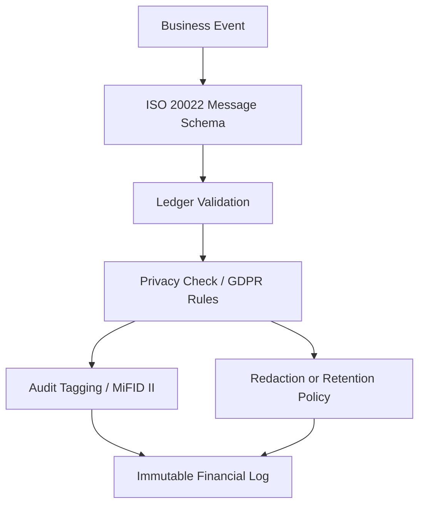

# Lesson 06: Regulatory Guardrails (ISO 20022 & GDPR)

## Objective
Understand the regulatory constraints that shape a production ledger before you write code. For a mechatronics engineer, think of this lesson as the equivalent of factory safety standards and calibration certificates: the system can be fast, but it must also be structured, traceable, and safe to audit. We will treat ISO 20022 as the universal data protocol for financial messages, GDPR as the privacy constraint set for personal data, and MiFID II as the audit-precision rule that forces high-quality timestamps and identifiers.

## Why It Matters for the Ledger
- **Interoperability**: ISO 20022 gives us a common message format so different systems can understand the same transaction without custom adapters everywhere.
- **Privacy constraints**: GDPR forces us to design for data minimization, purpose limitation, and controlled retention.
- **Audit quality**: MiFID II requires precise traces, including identifiers and timestamp discipline, so the ledger can be investigated later.
- **Engineering discipline**: Regulations are not paperwork only; they are design constraints that affect schema, storage, logging, redaction, and event flow.

## Key Concepts

### 1. ISO 20022 as a Universal Data Protocol
ISO 20022 is best understood as a structured language for financial messages. It is like a Modbus or CAN bus for money: every system can exchange messages using the same field layout, names, and meaning.
- It reduces ambiguity between banks, payment processors, and ledger services.
- It favors machine-readable fields over free-text payloads.
- It helps us avoid "mystery fields" that break reconciliation later.

In practice, ISO 20022 says: do not send a transaction as an unstructured blob if you can send it as a typed message with known fields.

### 2. GDPR as Data Safety Constraints
GDPR is not just about deleting data; it is a set of constraints for handling personal data safely.
- **Data minimization**: store only what you actually need.
- **Purpose limitation**: use the data only for the reason you collected it.
- **Retention control**: keep data only as long as required.
- **Right to erasure**: if personal data can be deleted, the system must support a lawful deletion or redaction path.

For a ledger, this creates tension: financial records often must remain auditable, but personal data should not be copied everywhere forever. The design answer is to separate immutable financial facts from personally identifying details and keep the personal layer as small and controlled as possible.

### 3. MiFID II as Audit Precision
MiFID II pushes the system toward evidence-grade traceability.
- Trade and event records need strong identifiers such as LEI and UTI.
- Time ordering matters, so timestamp precision is not optional.
- The project research anchors this at **1 ms timestamp synchronization** for event auditing.

Think of this like a calibration certificate on a machine sensor: if the timestamp is sloppy, the audit trail is weak even if the transaction itself is valid.

### 4. Redaction vs Immutability
This is the core design tension.
- A ledger wants immutable history for auditability.
- GDPR may require deletion or redaction of personal data.
- The engineering compromise is often to keep the financial event immutable while isolating or redacting the personal payload via a controlled policy.

That is why redactable ledger research matters: it gives us a path to handle privacy requests without destroying the financial record.

### 5. Compliance as Schema Design
Regulation is not something we add at the end.
- It affects message fields.
- It affects identifiers.
- It affects timestamps.
- It affects retention and redaction rules.
- It affects what belongs in the write model versus what belongs in the audit or identity subsystem.

## Mental Model (Mermaid)


## Applied Example (.NET 10 / C# 14)
The example below shows a simple record for a compliant ledger transaction. It separates the financial event from the compliance metadata so the ledger can remain auditable while still carrying regulatory context.

```csharp
public readonly record struct CompliantLedgerTransaction(
    Guid TransactionId,
    string MessageId,
    string DebtorAccount,
    string CreditorAccount,
    long AmountMinorUnits,
    string Currency,
    string PurposeCode,
    string? EndToEndId,
    string? LegalEntityIdentifier,
    string? UniqueTransactionIdentifier,
    DateTimeOffset TimestampUtc,
    int TimestampPrecisionMs,
    bool ContainsPersonalData,
    bool IsRedactable);

var tx = new CompliantLedgerTransaction(
    TransactionId: Guid.NewGuid(),
    MessageId: "pacs.008.001.08",
    DebtorAccount: "acct:company-a:operating",
    CreditorAccount: "acct:vendor-b:receivables",
    AmountMinorUnits: 10200,
    Currency: "USD",
    PurposeCode: "SUPP",
    EndToEndId: "E2E-20260402-0001",
    LegalEntityIdentifier: "5493001KJTIIGC8Y1R12",
    UniqueTransactionIdentifier: "UTI-2026-04-02-0001",
    TimestampUtc: DateTimeOffset.UtcNow,
    TimestampPrecisionMs: 1,
    ContainsPersonalData: false,
    IsRedactable: false
);
```

Why this shape works:
- The ISO 20022-style `MessageId` gives us a typed message context.
- The `TimestampPrecisionMs` field makes the audit precision explicit.
- The `ContainsPersonalData` and `IsRedactable` flags force the developer to think about GDPR at write time.
- The `AmountMinorUnits` field keeps the ledger deterministic and avoids floating-point money.

## Common Pitfalls
- **Treating compliance as paperwork**: if you add it only at the end, the schema will already be wrong.
- **Storing personal data everywhere**: copy-paste identity fields create GDPR exposure.
- **Using free-text payment descriptions as the source of truth**: reconciliation becomes brittle.
- **Ignoring timestamp precision**: audit trails become weak and disputed later.

## Interview Notes
- **ISO 20022** is the structured message language for financial interoperability, similar in spirit to a field protocol on an industrial network.
- **GDPR** is a privacy constraint system, not just a deletion rule.
- **MiFID II** pushes audit precision through identifiers and timestamp discipline.
- The hard part is balancing immutable financial history with privacy rights; that is why redactable or isolated data models matter.

## Sources
- [[chuen_2017|Lee & Deng, 2017]]: ISO 20022, MiFID II identifiers, and 1 ms timestamp auditing context.
- [[zhao_2024|Zhao et al., 2024]]: Permissioned redactable blockchain mechanisms relevant to GDPR-style redaction.

## TODO to Internalize
- [ ] Map one ISO 20022 field list to a ledger transaction in your own words.
- [ ] Explain the difference between immutable financial facts and personal data.
- [ ] Sketch where GDPR redaction would live in the write path.
- [ ] Identify which fields in the C# record should never be stored in plain free-text form.
