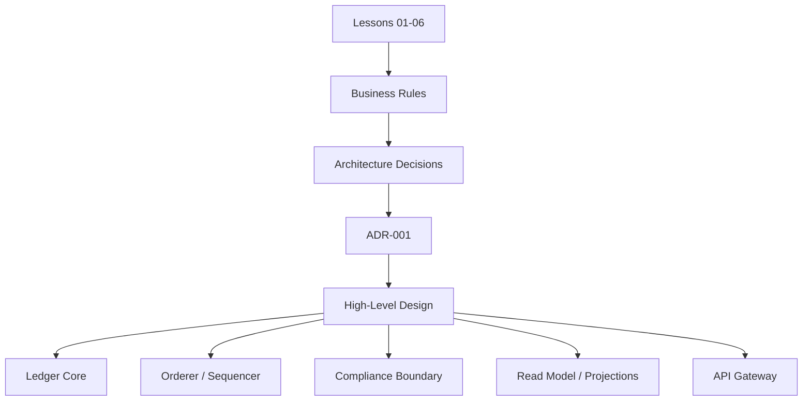

---
source:
  - BPA Report v1.2
  - Lesson 02 to Lesson 06 series
  - OrchestrationPolicy.md
phase: architecture
status: draft
last-updated: 2026-04-03
applied-in-project: yes
---

# Lesson 07: Bridge to Architecture

## Objective
Translate the concepts from Lessons 01 to 06 into the boundaries, responsibilities, and rules that the High-Level Design must respect. For a mechatronics engineer, this is the moment where you stop studying sensor behavior, control loops, and safety constraints in isolation and start drawing the actual plant layout: which controller owns which loop, where validation happens, what gets logged, and what can never be left to chance.

## Why It Matters for the Ledger
- **Domain continuity**: The architecture must preserve the accounting, ordering, performance, and compliance rules already established in the lesson series.
- **Boundary clarity**: A ledger system fails when responsibilities blur between intake, validation, ordering, projection, and compliance.
- **ADR readiness**: Architectural choices such as sequencing model, consistency model, and redaction strategy need a documented decision path before implementation.
- **Project alignment**: The BPA report describes the target system as a common semantic layer for Banking-as-a-Service, so the HLD must reflect that role instead of drifting into a generic CRUD service.

## Definitions

| Term | Definition |
| --- | --- |
| Architecture boundary | A responsibility line that says what a service owns, what it validates, and what it must never assume about other parts of the system. |
| ADR | Architecture Decision Record. A short design document that captures a decision, the alternatives, and the trade-offs so future changes stay traceable. |
| HLD | High-Level Design. The system-level view that shows services, flows, boundaries, and major technical decisions before detailed implementation begins. |
| Read model | A query-optimized representation of the ledger state used for fast lookups, dashboards, and reporting. |
| Sequencer | The component that assigns deterministic order to commands or events before validation and commit. |

## Key Concepts

### 1. Lessons 01 to 06 form one design chain
Each previous lesson contributes one layer of the architecture.
- Lesson 01 defines the business context: B2B neobank, partner banks, and bulk financial workflows.
- Lesson 02 defines the ledger primitive: append-only event storage and event sourcing.
- Lesson 03 defines the invariant: debits and credits must always balance.
- Lesson 04 defines the non-functional target: throughput, latency, and load behavior.
- Lesson 05 defines ordering: consensus and finality.
- Lesson 06 defines the guardrails: ISO 20022, GDPR, and MiFID II.

The architecture must keep all six layers visible at the same time. If one layer is missing, the design becomes technically elegant but financially wrong.

### 2. The HLD should map responsibilities, not just boxes
The first architectural mistake is drawing services before defining ownership.
- The ledger core owns financial truth and double-entry validation.
- The orderer or sequencer owns transaction ordering and finality coordination.
- The compliance boundary owns schema checks, audit metadata, and redaction policy.
- The projection layer owns query-ready read models and reporting views.
- The gateway owns transport, authentication, and request normalization.

Think of this like a factory line: the conveyor, inspection station, reject bin, and control cabinet may sit close together, but they do not do each other’s jobs.

### 3. Event flow should remain explicit
The BPA report describes the system as an event-driven ledger with validation and projection. That means the HLD should expose a flow such as:
1. Receive command.
2. Normalize and validate schema (ingest only — shape check).
3. Order or sequence the event (consensus assigns sequence number).
4. Apply accounting and compliance checks (DR=CR, ISO 20022, GDPR).
5. Append the event atomically.
6. Project the read model.

Step 2 is schema normalization only. Business rule and balance validation happen in step 4, after ordering, so all nodes validate against an identical sequence.

This is not a random implementation preference. It is the only way to preserve auditability, deterministic state, and high-volume processing without collapsing the ledger into a single overloaded service.

### 4. ADR-001 must capture the first architecture split
The first ADR should explain the core shape of the system.
- Why the ledger uses an event-sourced model.
- Why ordering is separated from validation.
- Why compliance is a first-class concern rather than a post-processing step.
- Why read models are projected instead of queried directly from the event log.

This matters because the first architecture split becomes the reference point for every later service decision.

### 5. Architecture is the place where rules become deployable
The lesson series already established the logic.
- Double-entry logic defines what is valid.
- Consensus defines when ordering is trustworthy.
- Performance anchors define how much load the system must absorb.
- Regulatory guardrails define what fields and metadata must exist.

The HLD turns those statements into deployable components, communication paths, and operational policies.

## Mental Model


## Mechatronics Bridge

| Architecture Concept | Mechatronics Analogy | Why It Matters |
| --- | --- | --- |
| Architecture boundary | Control cabinet partitioning | Separating panels prevents one subsystem from interfering with another. |
| ADR | Engineering design review note | The reason for a decision must be recorded so future changes are not guesswork. |
| Sequencer / orderer | PLC scan scheduler | Inputs are processed in a defined order so the system behaves deterministically. |
| Read model | HMI dashboard | Operators need a fast, readable view, not the raw signal stream. |
| Compliance boundary | Safety interlock circuit | The system must reject unsafe states before they reach the actuator. |

## Applied Example (.NET 10 / C# 14)
The example below shows a small architectural map object. It is not the final product design; it is a way to think about where each responsibility belongs before you write the HLD.

```csharp
public readonly record struct ArchitectureBoundary(
    string Name,
    string Responsibility,
    string PrimaryInput,
    string PrimaryOutput);

var boundaries = new[]
{
    new ArchitectureBoundary(
        Name: "Gateway",
        Responsibility: "Authenticate and normalize requests",
        PrimaryInput: "API command",
        PrimaryOutput: "Validated command envelope"),
    new ArchitectureBoundary(
        Name: "Sequencer",
        Responsibility: "Assign deterministic order",
        PrimaryInput: "Command envelope",
        PrimaryOutput: "Ordered event reference"),
    new ArchitectureBoundary(
        Name: "Ledger Core",
        Responsibility: "Apply double-entry validation and append immutable facts",
        PrimaryInput: "Ordered event",
        PrimaryOutput: "Committed ledger event"),
    new ArchitectureBoundary(
        Name: "Projection",
        Responsibility: "Materialize query views",
        PrimaryInput: "Committed event stream",
        PrimaryOutput: "Balance and reporting read models"),
    new ArchitectureBoundary(
        Name: "Compliance",
        Responsibility: "Enforce ISO 20022, GDPR, and MiFID II rules",
        PrimaryInput: "Event metadata",
        PrimaryOutput: "Audit and redaction status")
};
```

Why this shape works:
- It forces you to separate transport, ordering, validation, compliance, and projection.
- It makes the HLD easier to explain because every component has one clear job.
- It keeps the architecture traceable back to the lesson series instead of becoming abstract diagram art.

## Common Pitfalls
- **Drawing services before responsibilities**: boxes without ownership create confusion later.
- **Mixing validation with projection**: this blurs the write path and weakens auditability.
- **Treating compliance as a sidecar only**: regulatory checks need to influence the write model and event schema.
- **Skipping ADRs**: architecture decisions become tribal knowledge instead of project assets.

## Interview Notes
- The lesson series is not just theory; it is the reasoning chain that leads into the HLD.
- The HLD must preserve double-entry, ordering, performance, and compliance at the same time.
- A good architecture boundary has one owner, one responsibility, and one clear reason for existing.
- ADR-001 should record the first major split in the system, because later components depend on it.
- In a ledger, the read model is a consumer of truth, not the source of truth.

## Sources
- [BPA Report v1.2](../../02_analysis/bpa/BPA_Report.md): system scope, event flow, and architecture direction.
- [[chuen_2017|Lee & Deng, 2017]]: ISO 20022, MiFID II identifiers, and timestamp discipline.
- [[zhao_2024|Zhao et al., 2024]]: Redactable ledger mechanisms relevant to compliance boundaries.
- [[sonnino_2021|Sonnino, 2021]]: Consensus and finality constraints for ledger ordering.

## TODO to Internalize
- [ ] Map Lessons 01 to 06 into five architecture boundaries in your own words.
- [ ] Explain why the read model cannot be treated as the source of truth.
- [ ] Draft the first ADR title and its one-sentence decision statement.
- [ ] Sketch the HLD as a flow from API Gateway to Ledger Core to Projection.