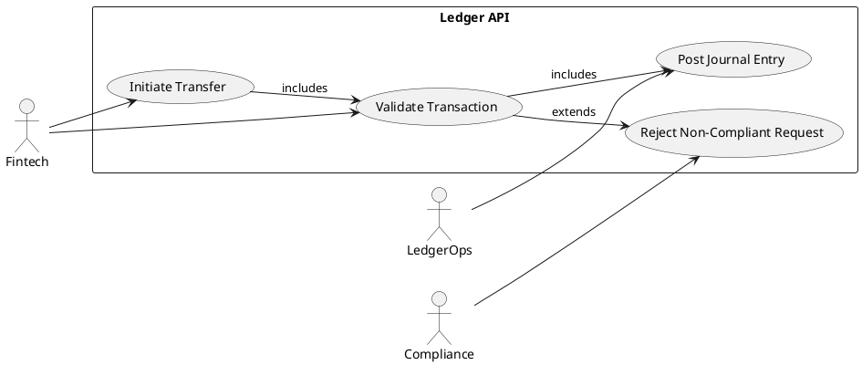

# Use Cases Cheatsheet for Requirements Extraction

## What a use case is
A use case describes how an actor achieves a goal with the system.
It is not the same as a user story, and it is not the same as a BPMN diagram.
Use cases sit between the process model and the backlog.

## Where to extract use cases from the BPA
Use the BPA like this:
- **Section 1**: identify the actors and their goals.
- **Section 2**: identify the main business flow that becomes the main success scenario.
- **Section 3**: identify pain points and exceptions that become alternate flows.
- **Section 4**: identify business rules that become preconditions, postconditions, or special rules.
- **Section 5.2**: use the To-Be flow as the future-state reference for the use case.
- **Sections 6-7**: use as non-functional constraints and future design notes, not as the use case flow itself.

## Extraction recipe
1. Start with one BPMN process.
2. Name the primary actor.
3. Write the actor goal in one sentence.
4. Convert the BPMN happy path into the main success scenario.
5. Add alternate flows for exceptions, rejections, and retries.
6. Pull preconditions and postconditions from the BPA rules.
7. Keep technical implementation details out of the use case body.
8. Link the use case to the BPMN note and later to user stories.

## Obsidian-friendly workflow
1. Start from the BPMN flow.
2. Identify actors.
3. Write each actor goal as a use case.
4. Add preconditions, trigger, main flow, alternatives, and postconditions.
5. Link the use case note to the BPMN note and the user-story note.

## PlantUML conventions
- Use one diagram per use-case cluster.
- Use `left to right direction` for readability.
- Keep actor names concrete.
- Keep use-case names goal-oriented.
- Avoid writing the full business rules inside the diagram.

## Core use-case structure
- **Primary actor**: who wants the goal.
- **Goal**: what the actor needs.
- **Preconditions**: what must be true before the flow starts.
- **Trigger**: what starts the use case.
- **Main success path**: the normal sequence.
- **Alternate flows**: invalid input, rejection, retry, timeout.
- **Postconditions**: what is true after success or failure.

## Good use-case examples for this project
- Initiate transfer
- Validate transfer request
- Post journal entry
- Check account balance
- Reject non-compliant transaction
- Project updated balance

## PlantUML skeleton


## Writing rules
- One use case = one actor goal.
- Use a verb phrase for the use case name.
- Do not hide exceptions in the main flow.
- Keep business rules outside the diagram and in the notes.
- If a step is complex, mention it and link to a BPMN note.

## Relationship to other artifacts
- BPMN explains the process flow.
- Use cases explain the actor goals.
- User stories express backlog items.
- Acceptance criteria define how to test the story.

## Common mistakes
- Making use cases into process diagrams.
- Adding too many technical details.
- Using vague actors like "System User".
- Writing goals that are really tasks.
- Skipping alternate flows.

## Quick template
```text
Use Case: <verb + goal>
Primary Actor: <who>
Goal: <what>
Preconditions: <what must already be true>
Trigger: <what starts it>
Main Flow: 1..n steps
Alternate Flows: <exceptions>
Postconditions: <result>
```

## Output quality checklist
- [ ] Actor is specific
- [ ] Goal is measurable
- [ ] Main flow is short and clear
- [ ] Alternate flows exist
- [ ] Preconditions and postconditions are written
- [ ] The use case maps to a BPMN path
- [ ] The use case can be turned into user stories
