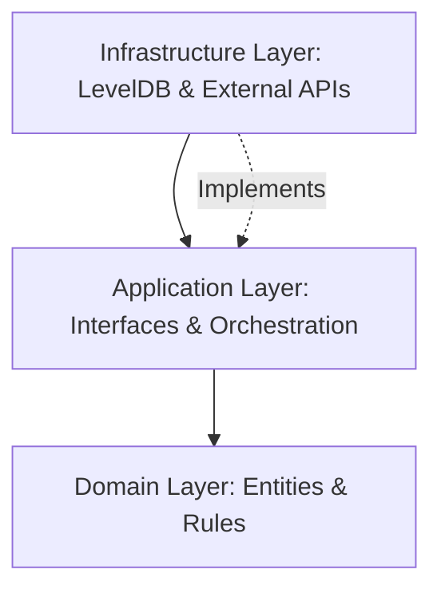
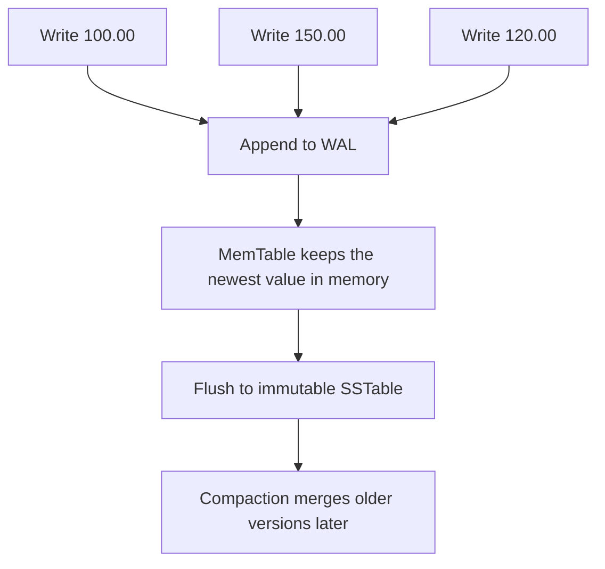

# Lesson 18.02: Infrastructure Layer & High-Performance Persistence

## 1. The Role of the Infrastructure Layer
In **Clean Architecture**, the Infrastructure layer is the "Plumbing." It contains the implementation of details that the Domain and Application layers don't care about.

### Architectural Choice: Dependency Inversion
- **Application Layer**: Defines an Interface (e.g., `IAccountRepository`).
- **Infrastructure Layer**: Implements that Interface (e.g., `LevelDbAccountRepository`).
- **Benefit**: We can swap LevelDB for SQL Server or MongoDB later without touching a single line of Business Logic.

---

## 2. Why LevelDB? (The Theory of LSM-Trees)
A traditional SQL database (like SQL Server or PostgreSQL) typically uses **B-Trees**. B-Trees are excellent for finding data quickly, but they require "random writes" to different parts of the disk, which is slow for high-frequency ledgers.

**LevelDB** uses an **LSM-Tree (Log-Structured Merge-Tree)**, which is designed for **extreme write performance**.

### A Simple Example
Imagine an account receives three balance updates in a short burst:

1. `acc-1001` starts at `100.00`
2. A deposit changes it to `150.00`
3. A payment changes it to `120.00`

With an LSM-tree, each write is handled as a fast append-style operation:

The important idea is that LevelDB does not keep rewriting the same disk page every time the balance changes. It appends the new version, keeps the latest value in memory, and cleans up older versions later in the background.

### How This Compares to SQL Server or PostgreSQL
SQL Server and PostgreSQL are general-purpose relational databases. They are excellent at querying, joining, and enforcing constraints, but their storage engines are built around different tradeoffs.

| Aspect | LevelDB / LSM-Tree | SQL Server / PostgreSQL |
| :--- | :--- | :--- |
| Write pattern | Append new versions quickly | Update indexed structures and table pages |
| Disk access | Mostly sequential writes | More random writes during updates |
| Background work | Compaction merges old files | Vacuum, checkpointing, page maintenance |
| Query power | Key-value lookups | SQL queries, joins, filters, transactions |
| Best fit | High-throughput write-heavy storage | Relational data and rich querying |

In practical terms, LevelDB is a better fit when the ledger mostly needs to store and retrieve records by key as fast as possible. SQL Server or PostgreSQL are better when you need complex queries, relational joins, or a full relational transaction model.

### How it works:
1.  **The MemTable (In-Memory)**: When you save an `Event`, it is first written to a sorted memory buffer (the MemTable). Writing to RAM is nearly instantaneous.
2.  **The WAL (Write-Ahead Log)**: To ensure we don't lose data if the power goes out, the write is also appended to a simple log file on disk. Appending to a log is a "sequential write," which is the fastest way to write to a disk.
3.  **SSTables (Immutable Files)**: When the MemTable gets too big, LevelDB freezes it and flushes it to disk as a **Sorted String Table (SSTable)**. These files are never modified (Immutable).

### Compaction
Since we have many small SSTable files on disk, searching for an account might be slow (we'd have to look in every file). 
- LevelDB runs a background process called **Compaction**.
- It "merges" small files into larger ones, removing old or deleted versions of data.
- It’s like a librarian constantly organizing small stacks of books into a single, alphabetized shelf.

### Why this fits a Ledger:
- **Sequential Performance**: LSM-Trees turn random ledger entries into a single continuous stream of data on the disk.
- **Append-Only Nature**: Since SSTables are immutable, it perfectly matches the "Once written, never changed" rule of a financial ledger.
- **High Throughput**: It can handle the massive burst of transactions during a "Black Friday" event without breaking a sweat.

---

## 3. Entities vs. DTOs (Data Transfer Objects)
This is a common "best practice" that avoids many bugs.

- **Domain Entity**: Optimized for **Business Rules**. (e.g., `Account.cs` with private setters and methods).
- **Persistence DTO**: Optimized for **Storage**. (e.g., `AccountDto.cs` which is a flat "record" that LevelDB can easily serialize).

### The "Adapter" Pattern
We never save the `Account` entity directly. Instead:
1.  **Map**: Convert `Account` (Entity) -> `AccountDto` (DTO).
2.  **Serialize**: Convert `AccountDto` -> `JSON string` or `Byte[]`.
3.  **Save**: Write to LevelDB.

**Reason**: If we change a private method in our Domain Entity, we don't want to break the format of data already saved on disk. The DTO acts as a "Buffer."

---

## 4. Serialization Strategy
Since LevelDB is a "Key-Value" store, we must decide how to represent our data:

| Type | Key Format | Value Format |
| :--- | :--- | :--- |
| **Account** | `acc:{AccountId}` | JSON string of AccountDto |
| **Event** | `evt:{SequenceNumber}` | JSON string of EventDto |
| **Balance** | `bal:{AccountId}` | JSON string of BalanceDto |

**Best Practice**: We use **System.Text.Json** (built into .NET) with specific options to handle our Value Objects (like `CurrencyAmount`).

---

## 5. Serialization & Atomic Writes
In a Ledger, "Order is everything."
- **Batching**: LevelDB allows `WriteBatch`. This means we can save a `Transaction`, its `Entries`, and the updated `Balance` all at once. If the power goes out mid-save, either *all* of them are saved or *none* of them are. 

---

**Today's Implementation Path**:
1.  **DTO Creation**: We will build the "flat" versions of your Entities.
2.  **Repository Interfaces**: We will define how the Application layer wants to talk to the DB.
3.  **LevelDB Wrapper**: We will write the code that opens the DB and handles the "Keys" and "Values."

