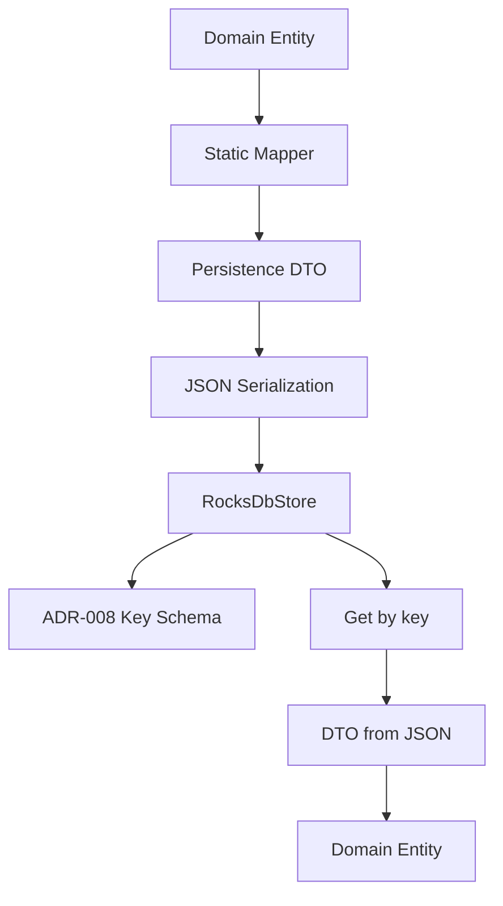

# Lesson 19.02: RocksDB Store and Static Mapping

## Objective
This lesson explains the Week 19 persistence implementation in plain language. It walks through the dependency change to RocksDB, the static mapper pattern, the ADR-008 key schema, and the `RocksDbStore` class that saves and loads ledger entities as JSON.

## Why It Matters for the Ledger
- The ledger needs a persistence layer that is fast for writes and predictable for reads.
- The domain model must stay independent from storage details, so the Infrastructure layer acts as the translation boundary.
- A clear key schema and manual mappers make the data format easier to debug, test, and evolve.

## Key Concepts
- RocksDB as an embedded key-value store
- Static extension mappers instead of AutoMapper
- Domain entities versus persistence DTOs
- Namespaced keys and lexicographic ordering
- JSON serialization with `System.Text.Json`
- Safe read paths that return `null` when a key does not exist

## Mental Model


## Guided Review of the Implementation

### 1. Dependency Change
The Infrastructure project now references `RocksDb.Net` instead of `LevelDB.Net`.

Why this matters:
- The repository pivoted from the older LevelDB path to the RocksDB-based design described in ADR-008.
- The store implementation uses the real `RocksDbNet` namespace and string-based `Open`, `Put`, and `GetString` APIs.

### 2. Static Mappers
The mapper files in [Persistence/Mappers](/home/novillus/Documents/vscode/NeoBank-Ledger-Project/src/NeoBank.Ledger.Infrastructure/Persistence/Mappers) convert each domain entity into its DTO and back again.

Examples:
- [AccountMapper.cs](/home/novillus/Documents/vscode/NeoBank-Ledger-Project/src/NeoBank.Ledger.Infrastructure/Persistence/Mappers/AccountMapper.cs)
- [EventMapper.cs](/home/novillus/Documents/vscode/NeoBank-Ledger-Project/src/NeoBank.Ledger.Infrastructure/Persistence/Mappers/EventMapper.cs)
- [BalanceMapper.cs](/home/novillus/Documents/vscode/NeoBank-Ledger-Project/src/NeoBank.Ledger.Infrastructure/Persistence/Mappers/BalanceMapper.cs)
- [PartyMapper.cs](/home/novillus/Documents/vscode/NeoBank-Ledger-Project/src/NeoBank.Ledger.Infrastructure/Persistence/Mappers/PartyMapper.cs)
- [AuditBlockMapper.cs](/home/novillus/Documents/vscode/NeoBank-Ledger-Project/src/NeoBank.Ledger.Infrastructure/Persistence/Mappers/AuditBlockMapper.cs)
- [RejectionRecordMapper.cs](/home/novillus/Documents/vscode/NeoBank-Ledger-Project/src/NeoBank.Ledger.Infrastructure/Persistence/Mappers/RejectionRecordMapper.cs)

What the mappers do:
- They flatten value objects during `ToDto`.
- They reconstruct value objects during `ToEntity`.
- They keep the conversion logic explicit, which is safer than reflection-based mapping.

### 3. Value Objects and Round-Tripping
Some domain properties are value objects rather than primitive strings.

Examples:
- `Account.OwnerLEI` is a `LegalEntityIdentifier`.
- `Transaction.UTI` is a `UniqueTransactionIdentifier`.
- `Transaction.Amount` is a `CurrencyAmount`.

In the mapper layer:
- `entity.OwnerLEI.Value` becomes a string inside `AccountDto`.
- `new LegalEntityIdentifier(dto.OwnerLEI)` rebuilds the value object on read.
- `new UniqueTransactionIdentifier(dto.UTI)` does the same for transaction identifiers.

Why this matters:
- The DTO is a storage shape, not a business shape.
- The domain object keeps validation rules and meaning.
- The persistence format stays stable even if the domain changes internally.

### 4. The ADR-008 Key Schema
The store builds keys using explicit prefixes so the keyspace behaves like named tables.

Current patterns:
- `acc:{AccountId}` for accounts
- `evt:{SequenceNumber:D20}` for events
- `bal:{AccountId}` for balances
- `pty:{PartyId}` for parties
- `aud:{BlockHeight:D20}` for audit blocks
- `rej:{UTI}` for rejection records

Why the zero-padding matters:
- `evt:00000000000000000002` sorts before `evt:00000000000000000010`.
- That keeps event replay ordered when RocksDB iterates keys lexicographically.

### 5. The RocksDbStore Constructor
The store is created in [RocksDbStore.cs](/home/novillus/Documents/vscode/NeoBank-Ledger-Project/src/NeoBank.Ledger.Infrastructure/Persistence/RocksDbStore.cs).

Constructor behavior:
- It resolves a database directory.
- It creates the directory if needed.
- It opens RocksDB with `CreateIfMissing = true`.
- It wraps open failures in a clear `InvalidOperationException`.

Why this is good:
- The app fails fast if the DB cannot open.
- The error message is explicit.
- The store is still easy to instantiate in tests by passing a custom path.

### 6. Save Path
The `Save` methods all follow the same flow:

1. Pick the correct key.
2. Convert the domain entity to a DTO.
3. Serialize the DTO with `System.Text.Json`.
4. Write the JSON string into RocksDB.

Example shape:
```csharp
public void Save(Account account) => Put(BuildAccountKey(account.AccountId), account.ToDto());
```

That line tells you the whole design:
- the entity stays in the domain layer,
- the mapper handles conversion,
- the store handles persistence details only.

### 7. Read Path
The `Get...` methods return nullable domain entities.

Example shape:
```csharp
public Account? GetAccount(Guid accountId) => Get<AccountDto>(BuildAccountKey(accountId))?.ToEntity();
```

Read flow:
- The store looks up the key.
- If nothing exists, it returns `null`.
- If JSON exists, it deserializes the DTO.
- The mapper reconstructs the domain entity.

This is safer than throwing on missing keys because absence is a normal result in key-value storage.

### 8. Why `Party` Needed a Small Domain Adjustment
The `Party` entity originally stored `RegistrationStatus` with a private setter and no constructor path.

That created a round-trip problem:
- the DTO can store the field,
- the mapper can read it,
- but the entity could not restore it cleanly.

The fix was to add an optional constructor parameter in [Party.cs](/home/novillus/Documents/vscode/NeoBank-Ledger-Project/src/NeoBank.Ledger.Domain/Entities/Party.cs) so persistence can recreate the entity without reflection or ad hoc mutation.

## Applied Example (.NET 10 / C# 14)
```csharp
var store = new RocksDbStore("/tmp/neobank-rocksdb");

var account = new Account(
    Guid.NewGuid(),
    new LegalEntityIdentifier("5493001KJTIIGC8Y1R12"),
    "ACC-1001",
    "USD",
    "pk:acc-1001",
    "shard-a",
    "zone-1",
    AccountStatus.Active,
    DateTimeOffset.UtcNow);

store.Save(account);

Account? loaded = store.GetAccount(account.AccountId);
```

What happens here:
- `Save` converts the account to `AccountDto`.
- The DTO becomes JSON.
- RocksDB stores the JSON under the `acc:{AccountId}` key.
- `GetAccount` retrieves the JSON and turns it back into an `Account`.

## Common Pitfalls
- Treating RocksDB like a relational database and expecting joins or ad hoc queries.
- Forgetting that key order matters when you need replay or range scans.
- Using reflective mapping when the repository already decided to keep mapping explicit and static.
- Returning exceptions for missing keys instead of using `null` for normal absence.
- Letting persistence DTOs leak into the domain layer.

## Interview Notes
- RocksDB is a good fit when the system needs fast writes, deterministic key lookups, and a simple embedded persistence engine.
- Static mappers are used because they are explicit, fast, and compile-time safe.
- The domain model stays isolated from persistence by converting to DTOs before storage and back to entities on read.
- Zero-padded numeric keys keep event and audit ordering correct in lexicographic storage engines.

## Sources
- [RocksDbStore.cs](/home/novillus/Documents/vscode/NeoBank-Ledger-Project/src/NeoBank.Ledger.Infrastructure/Persistence/RocksDbStore.cs)
- [AccountMapper.cs](/home/novillus/Documents/vscode/NeoBank-Ledger-Project/src/NeoBank.Ledger.Infrastructure/Persistence/Mappers/AccountMapper.cs)
- [EventMapper.cs](/home/novillus/Documents/vscode/NeoBank-Ledger-Project/src/NeoBank.Ledger.Infrastructure/Persistence/Mappers/EventMapper.cs)
- [BalanceMapper.cs](/home/novillus/Documents/vscode/NeoBank-Ledger-Project/src/NeoBank.Ledger.Infrastructure/Persistence/Mappers/BalanceMapper.cs)
- [PartyMapper.cs](/home/novillus/Documents/vscode/NeoBank-Ledger-Project/src/NeoBank.Ledger.Infrastructure/Persistence/Mappers/PartyMapper.cs)
- [AuditBlockMapper.cs](/home/novillus/Documents/vscode/NeoBank-Ledger-Project/src/NeoBank.Ledger.Infrastructure/Persistence/Mappers/AuditBlockMapper.cs)
- [RejectionRecordMapper.cs](/home/novillus/Documents/vscode/NeoBank-Ledger-Project/src/NeoBank.Ledger.Infrastructure/Persistence/Mappers/RejectionRecordMapper.cs)
- [ADR-007: Static Mapping over Third-Party Libraries](/home/novillus/Documents/vscode/NeoBank-Ledger-Project/docs/03_architecture/adr/ADR-007-Static-Mapping-Strategy.md)
- [ADR-008: RocksDB Key Schema and Serialization Strategy](/home/novillus/Documents/vscode/NeoBank-Ledger-Project/docs/03_architecture/adr/ADR-008-RocksDB-Key-Schema-and-Serialization-Strategy.md)
- [Lesson 19.01: Persistence Architecture (EF Core vs RocksDB & Mapping)](/home/novillus/Documents/vscode/NeoBank-Ledger-Project/docs/01_lessons/w19/lesson-01-persistence-architecture.md)

## TODO to Internalize
- [ ] Rewrite from memory
- [ ] Apply in project code
- [ ] Explain to Gemini/Copilot in your own words
