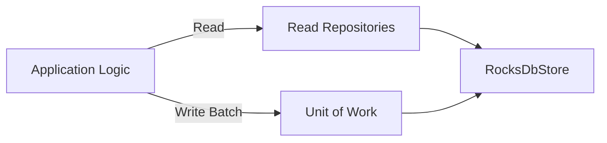

# Lesson 19.03: The Repository Pattern and the Unit of Work

In complex systems like a financial ledger, how we *access* data is just as important as how we *store* it. We use two key patterns to keep our code clean and reliable.

## 1. The Repository Pattern (For Reading)
A **Repository** acts as an in-memory collection of objects. The Application layer asks the repository for an entity, and the repository hides the logic of talking to RocksDB.

- **Purpose**: Decouple the "What" (I want an Account) from the "How" (RocksDB `Get` with an `acc:` prefix).
- **Naming**: We use interfaces like `IAccountRepository` and `IBalanceRepository`.

### Why separate read repositories?
In the future, we might want to scale the "Read Side" of our system differently from the "Write Side" (a pattern called **CQRS**). Having separate read repositories makes this easy.

---

## 2. The Unit of Work Pattern (For Writing)
A **Unit of Work (UoW)** maintains a list of objects affected by a single business transaction and coordinates the writing out of changes.

In our Ledger, a single user command (e.g., "Transfer 100 USD") involves:
1. Creating a **Transaction** record.
2. Creating two **Entries** (Debit/Credit).
3. Updating two **Balances**.

### The "Atomicity" Requirement
If the system crashes after step 2 but before step 3, the ledger is "Out of Balance." Money has disappeared.
- **RocksDB Solution**: We use a `WriteBatch`. 
- **The Pattern**: Instead of having every repository save itself, we use a single **Ledger Store** or **Unit of Work** that collects all these changes and sends them to RocksDB in one single "Batch" operation. Either everything is saved, or nothing is.

---

## 3. The Hybrid Approach: "Segregated Persistence"

Following our deliberation, we are implementing:

| Component | Responsibility | Pattern |
| :--- | :--- | :--- |
| **Read Side** | Fetching individual accounts or checking a balance. | **IAccountRepository**, **IBalanceRepository** |
| **Write Side** | Committing a full transaction with its entries and balance updates. | **ILedgerUnitOfWork** |

### Benefit for you (The Developer)
This makes the code much safer. You can't accidentally "forget" to save a balance update because the `ILedgerUnitOfWork` will require all pieces of the transaction before it allows a `Commit()`.
