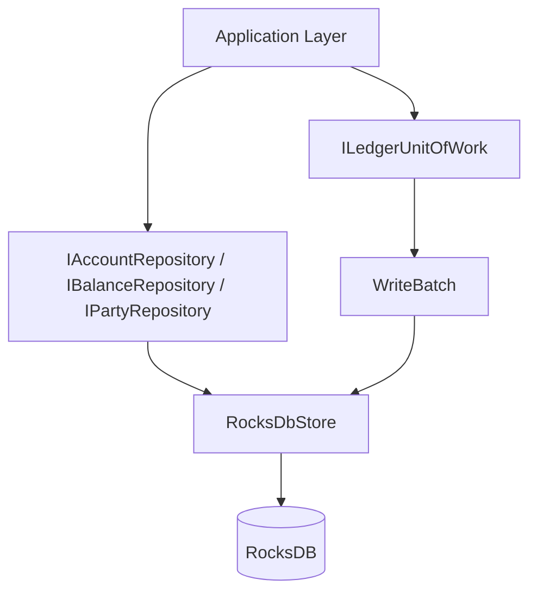

# Lesson 19.04: Repository Interfaces and Unit of Work

## Objective
This lesson explains how the Application layer talks to the Infrastructure layer through repository interfaces and how the write side uses a Unit of Work to commit multiple changes atomically. It also shows why the implementation needed extra DTOs and mappers for the transaction and entry write path.

## Why It Matters for the Ledger
- A ledger must read data without knowing which database is underneath it.
- A transfer touches multiple entities, so partial writes are not acceptable.
- Separating read repositories from the write Unit of Work keeps the code easier to test and easier to extend.

## Key Concepts
- Repository pattern for reads
- Unit of Work pattern for atomic writes
- `Task.FromResult` for synchronous read wrappers
- `Task.Run` for synchronous write wrappers
- RocksDB `WriteBatch` for atomic persistence
- DTOs as storage shapes
- Static mappers as the translation layer

## Mental Model


## Guided Review of the Implementation

### 1. Application Interfaces
The Application project now contains the persistence contracts in `IAccountRepository.cs`, `IBalanceRepository.cs`, `IPartyRepository.cs`, and `ILedgerUnitOfWork.cs`.

What these interfaces do:
- `IAccountRepository.cs` lets the Application layer ask for an account by id.
- `IBalanceRepository.cs` lets the Application layer ask for the current balance projection by account id.
- `IPartyRepository.cs` lets the Application layer look up party reference data.
- `ILedgerUnitOfWork.cs` defines the atomic write operation for a transaction and its updated balances.

Why this matters:
- The Application layer depends on abstractions, not on RocksDB.
- The domain code stays portable.
- Tests can mock these interfaces without loading the database.

### 2. Thin Read Repositories
The Infrastructure project implements those interfaces in `RocksDbAccountRepository.cs`, `RocksDbBalanceRepository.cs`, and `RocksDbPartyRepository.cs`.

The pattern is simple:
- inject `RocksDbStore` through the constructor,
- call the appropriate read method,
- return `Task.FromResult(...)`.

Example shape:
```csharp
public Task<Account?> GetByIdAsync(Guid id) => Task.FromResult(rocksDbStore.GetAccount(id));
```

Why the repository is thin:
- The conversion work already happens inside `RocksDbStore` and the static mappers.
- The repository should not introduce extra logic.
- It just bridges the Application interface to the storage adapter.

### 3. The Unit of Work
The write side is implemented in `RocksDbLedgerUnitOfWork.cs`.

What it does:
- converts the transaction aggregate to `TransactionDto` using `TransactionMapper.cs`,
- converts any supplied entry records to `EntryDto` using `EntryMapper.cs`,
- converts each balance projection with `BalanceMapper.cs`,
- stages all of them inside a single `WriteBatch`,
- flushes the batch through `RocksDbStore.Write(...)`.

Why this is important:
- If the process fails halfway through, RocksDB either commits the whole batch or none of it.
- That protects the ledger from partial state.
- A transfer cannot leave entries written but balances missing.

### 4. Why the Write Side Uses DTOs
The repository bridge introduced `TransactionDto.cs` and `EntryDto.cs`.

That was necessary because the write path needs a stable storage shape.

Examples:
- `TransactionDto.cs` flattens `CurrencyAmount` into `AmountMinorUnits` and `AmountCurrencyCode`.
- `EntryDto.cs` stores the primitive values for the posting record.
- `TransactionMapper.cs` reconstructs the `Transaction` entity on read or write boundary crossings.
- `EntryMapper.cs` does the same for `Entry`.

This keeps the domain model clean:
- domain objects keep business meaning,
- DTOs keep storage shape,
- mappers do the conversion explicitly.

### 5. RocksDbStore as the Shared Adapter
`RocksDbStore.cs` is the low-level adapter both repositories and the Unit of Work rely on.

It now does two jobs:
- it provides read helpers like account, balance, and party retrieval,
- it exposes a batch write method so the Unit of Work can persist multiple changes atomically.

It also owns the key schema helpers now, which is the better semantic place for them.
That keeps `RocksDbLedgerUnitOfWork.cs` focused on orchestration instead of duplicating key-format rules.

That separation is useful because:
- the repositories stay small,
- the Unit of Work owns write coordination,
- the database access code stays in one place.

### 6. Optional Entries in the Unit of Work
The current domain `Transaction` entity does not yet expose an entry collection directly.

To keep the interface useful without blocking the implementation, `ILedgerUnitOfWork` accepts an optional entries collection.

That means:
- the repository bridge works now,
- the batch write structure is ready for the sequencer,
- entries can be added without redesigning the interface later.

### 7. Why `Task.FromResult` and `Task.Run` Were Used
The RocksDB wrapper is synchronous in this implementation.

So the async methods are wrapped like this:
- reads use `Task.FromResult(...)` because they are simple lookups,
- the Unit of Work uses `Task.Run(...)` because it may stage and flush a larger batch.

If this pattern feels new, that is normal. `Task.FromResult(...)` and `Task.Run(...)` can look unusual the first time you see them, but they are just a way to preserve the async contract without pretending the database call is truly asynchronous.

This keeps the API async-friendly even though the storage engine calls are synchronous.

## Applied Example (.NET 10 / C# 14)
```csharp
var account = await accountRepository.GetByIdAsync(accountId);
var balance = await balanceRepository.GetByAccountIdAsync(accountId);

await ledgerUnitOfWork.CommitAsync(
    transaction,
    [balance],
    entries);
```

What happens here:
- the read repositories fetch the current state from RocksDB,
- the Unit of Work batches the transaction, entries, and balances,
- the commit becomes one atomic write operation.

## Common Pitfalls
- Putting business logic inside the repository classes.
- Returning domain objects directly from ad hoc JSON without a mapper.
- Using multiple separate writes instead of one `WriteBatch` for a transfer.
- Treating the async interface as if it made the database call truly asynchronous when it is only wrapped for contract consistency.
- Forgetting that read repositories and the Unit of Work serve different responsibilities.

## Interview Notes
- Repositories are used for read access because they hide storage details from the Application layer.
- A Unit of Work is used for writes because a ledger transfer must update multiple records atomically.
- `WriteBatch` is the key RocksDB feature that makes the atomic write side practical.
- DTOs and static mappers keep the domain model insulated from storage shape changes.
- The implementation uses thin repositories and a centralized write coordinator, which is a clean architecture-friendly shape.

## Sources
- `IAccountRepository.cs`
- `IBalanceRepository.cs`
- `IPartyRepository.cs`
- `ILedgerUnitOfWork.cs`
- `RocksDbAccountRepository.cs`
- `RocksDbBalanceRepository.cs`
- `RocksDbPartyRepository.cs`
- `RocksDbLedgerUnitOfWork.cs`
- `RocksDbStore.cs`
- `TransactionDto.cs`
- `EntryDto.cs`
- `TransactionMapper.cs`
- `EntryMapper.cs`
- `lesson-03-repository-and-unit-of-work.md`
- `ADR-009-Repository-and-Unit-of-Work-Pattern.md`

## TODO to Internalize
- [ ] Rewrite from memory
- [ ] Apply in project code
- [ ] Explain to Gemini/Copilot in your own words
