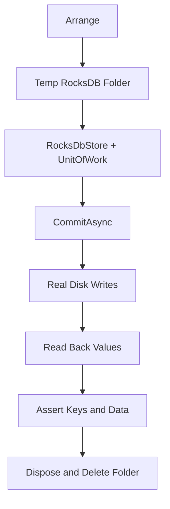

# Lesson 20.03: Atomicity Integration Tests for RocksDB

## Objective
This lesson explains how to prove `RocksDbLedgerUnitOfWork` atomicity with a real RocksDB instance. It shows the clean-room test pattern, the minimal store read helpers used for verification, and why the test checks both key namespacing and persisted values.

## Why It Matters for the Ledger
- Ledger writes must be all-or-nothing, not partial.
- Atomicity is a system property, so a real database test is more valuable than a mock-only unit test.
- Namespaced keys and round-tripped values are part of the persistence contract, not an implementation detail.

## Key Concepts
- Clean Room Pattern
- xUnit integration testing
- Real RocksDB on disk
- Atomic `WriteBatch` persistence
- Namespaced keys: `txn:`, `ent:`, `bal:`
- Value round-trip verification

## Mental Model


## Applied Example (.NET 10 / C# 14)
```csharp
using var store = new RocksDbStore(databasePath);
var unitOfWork = new RocksDbLedgerUnitOfWork(store);

await unitOfWork.CommitAsync(transaction, balances, entries);

Assert.NotNull(store.GetTransaction(transaction.TransactionId));
Assert.NotNull(store.GetEntry(transaction.TransactionId, 1));
Assert.NotNull(store.GetBalance(balances[0].AccountId));
```

What the test proves:
- the transaction, entries, and balances are written together,
- the RocksDB keys keep the expected namespace prefixes,
- the read-back values match the original objects.

## Common Pitfalls
- Testing atomicity only with mocks instead of a real database.
- Forgetting to clean up the temporary RocksDB folder after the test.
- Checking the in-memory entities but not the persisted JSON on disk.
- Verifying existence without also verifying the stored values.

## Interview Notes
- A Unit of Work is only useful if it commits multiple entities atomically.
- Integration tests are the right place to prove ledger durability and key schema behavior.
- The Clean Room Pattern prevents one test’s database state from contaminating another.

## Sources
- `docs/00_meta/orchestration/prompts/w20/03-implement-atomicity-tests.md`
- `tests/NeoBank.Ledger.Infrastructure.Tests/Persistence/RocksDbLedgerUnitOfWorkTests.cs`
- `src/NeoBank.Ledger.Infrastructure/Persistence/RocksDbStore.cs`
- `src/NeoBank.Ledger.Infrastructure/Persistence/Repositories/RocksDbLedgerUnitOfWork.cs`
- `lesson-02-integration-testing-rocksdb.md`

## TODO to Internalize
- [ ] Rewrite from memory
- [ ] Apply in project code
- [ ] Explain to Gemini/Copilot in your own words