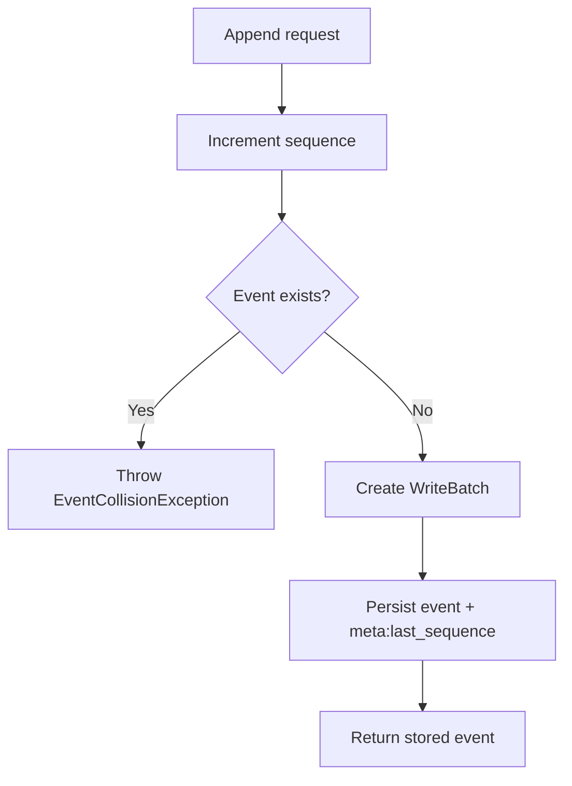

# Lesson 20.04: Event Store Immutability Guard

## Objective
This lesson explains how the ledger protects event-log immutability in `RocksDbEventStore`. It shows how the store checks for an existing event at the next sequence number before opening a `WriteBatch`, why the new `EventCollisionException` makes the failure explicit, and how the integration test proves the guard works against a real RocksDB instance.

## Why It Matters for the Ledger
- The event log is the historical source of truth, so sequence reuse would corrupt auditability.
- A collision guard prevents accidental overwrites before any write batch is opened.
- A real integration test proves the immutability contract on disk, not just in memory.

## Key Concepts
- Event-log immutability
- `EventCollisionException`
- Pre-batch existence check with `RocksDbStore.GetEvent(long)`
- Sequence rollback with `Interlocked.Decrement`
- Clean-room integration testing
- Real RocksDB collision verification

## Mental Model (Mermaid)


## Applied Example (.NET 10 / C# 14)
```csharp
long nextSequence = Interlocked.Increment(ref _lastSequence);

if (rocksDbStore.GetEvent(nextSequence) is not null)
{
    Interlocked.Decrement(ref _lastSequence);
    throw new EventCollisionException(nextSequence);
}
```

What this guard does:
- it assigns the next candidate sequence,
- checks RocksDB for an existing event at that sequence,
- aborts before the batch write begins if a collision is found.

The matching integration test does this in two steps:
- write the first event to a real RocksDB folder,
- reset the in-memory sequencer and attempt to append again so the guard throws `EventCollisionException`.

## Common Pitfalls
- Checking immutability only after opening a write batch.
- Treating the exception as generic instead of carrying the colliding sequence number.
- Verifying the guard only with mocks instead of a real event-store append.
- Forgetting to restore the in-memory sequencer when the guard aborts the append.

## Interview Notes
- Event-store immutability is enforced by a collision check before persistence, not by trusting callers.
- The exception makes the failure explicit and traceable during debugging and auditing.
- Integration tests are the right way to prove that the store rejects sequence reuse on disk.

## Sources
- `src/NeoBank.Ledger.Domain/Exceptions/EventCollisionException.cs`
- `src/NeoBank.Ledger.Infrastructure/Persistence/Repositories/RocksDbEventStore.cs`
- `tests/NeoBank.Ledger.Infrastructure.Tests/Persistence/RocksDbEventStoreTests.cs`
- `docs/00_meta/orchestration/prompts/w20/04-implement-immutability-guard.md`

## TODO to Internalize
- [ ] Rewrite from memory
- [ ] Apply in project code
- [ ] Explain to Gemini/Copilot in your own words