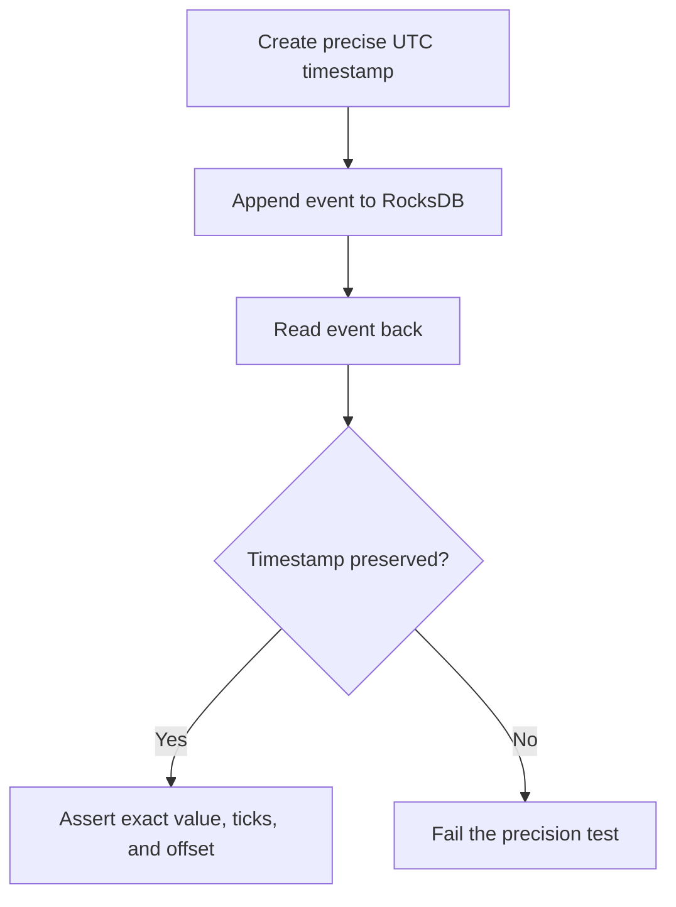

# Lesson 20.06: Precision Validation Tests

## Objective
This lesson explains the precision validation tests added for `RocksDbEventStore`. The goal is to prove that timestamps survive a full round-trip through RocksDB without losing UTC information or sub-millisecond precision, and to show why the test uses `Assert.All` with `TimeSpan.Zero`.

## Why It Matters for the Ledger
- MiFID II traceability depends on preserving timestamp precision.
- Event ordering becomes harder to audit if UTC information is lost during persistence.
- A replay test should prove both monotonic sequence order and chronological timestamp order.

## Key Concepts
- `DateTimeOffset` round-tripping
- UTC offset validation
- `Assert.All`
- `TimeSpan.Zero`
- Chronological replay ordering
- Clean-room integration tests

## Mental Model (Mermaid)


## Applied Example (.NET 10 / C# 14)
```csharp
Assert.All(events, @event => Assert.Equal(TimeSpan.Zero, @event.Timestamp.Offset));
```

`Assert.All` means: run the same assertion against every item in the collection.

In this test, that matters because we do not only want to check the first event or the last event. We want to prove that **every retrieved event** still uses UTC after the RocksDB round-trip.

`TimeSpan.Zero` means the offset is exactly `+00:00`.

That is important because:
- it confirms the timestamp is UTC,
- it avoids hidden local-time offsets,
- it makes replay ordering easier to reason about,
- it keeps the test readable without magic numbers.

Important detail:
- `TimeSpan.Zero` does **not** mean the timestamp has zero duration.
- It means the `DateTimeOffset.Offset` property is zero, which is the UTC offset.

## How the Precision Test Works
The precision validation test does three checks:
1. It creates a timestamp with a specific millisecond value and extra ticks.
2. It saves the event through `RocksDbEventStore`.
3. It reads the event back and verifies that the timestamp is unchanged.

The important assertions are:
- the full `DateTimeOffset` value matches,
- the `Ticks` value matches,
- the `Millisecond` component matches,
- the `Offset` is `TimeSpan.Zero`.

That combination proves two things at once:
- the system preserves the full `DateTimeOffset` precision,
- the stored timestamp remains normalized to UTC.

## How the Ordering Test Works
The replay test appends three events with timestamps separated by one millisecond.

Then it verifies:
- the sequence numbers are `1`, `2`, `3`,
- the timestamps come back in chronological order,
- each timestamp still has a zero UTC offset.

That gives confidence that the event store preserves both the write order and the temporal order.

## Common Pitfalls
- Using `Assert.Single` or checking only one event when the whole collection should be validated.
- Comparing only milliseconds and ignoring ticks.
- Forgetting to assert UTC, which can hide local-time drift.
- Treating `TimeSpan.Zero` as a duration value instead of an offset value.

## Interview Notes
- `Assert.All` is a collection-wide assertion helper.
- `TimeSpan.Zero` is the canonical way to assert UTC offset in `DateTimeOffset`.
- The precision test is stronger when it checks full ticks, not only milliseconds.
- The replay test proves chronological ordering and sequence monotonicity together.

## Sources
- `tests/NeoBank.Ledger.Infrastructure.Tests/Persistence/RocksDbEventStoreTests.cs`
- `docs/00_meta/orchestration/prompts/w20/06-precision-validation-tests.md`

## TODO to Internalize
- [ ] Rewrite from memory
- [ ] Explain `Assert.All` in one sentence
- [ ] Explain why `TimeSpan.Zero` means UTC offset