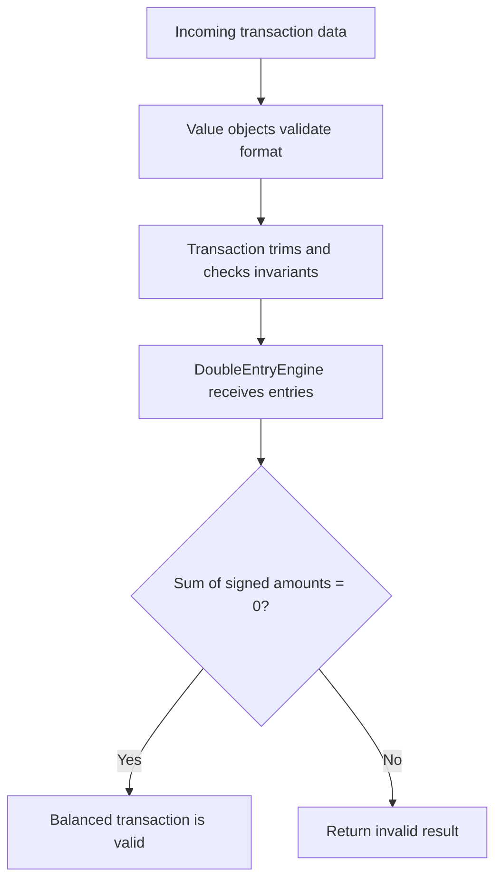

# Lesson 20.08: Double-Entry Engine Implementation and Domain Hardening

This lesson explains the implementation that turned the Double-Entry Axiom into working domain code. It covers the new stateless `DoubleEntryEngine`, the guarded arithmetic in `CurrencyAmount`, and the stricter validation now enforced by `Transaction`, `UTI`, `LEI`, and `ISIN`.

## Objective
Show how the ledger now enforces domain rules in code instead of leaving them to infrastructure or ad hoc checks. The key idea is that internal invariants belong to the entity or value object, while the double-entry balance check belongs to a stateless domain service.

## Why It Matters for the Ledger
- Money math must not silently mix currencies.
- A transaction should fail fast when its core legal or numeric data is invalid.
- The double-entry rule is a system law, so it needs a clear, isolated implementation.

## Key Concepts
- `CurrencyAmount` operator safety
- Mixed-currency rejection
- `ISIN` value object
- UTI and LEI normalization
- Transaction invariants
- Stateless domain service
- Double-entry balance validation

## Mental Model


## Applied Example (.NET 10 / C# 14)
```csharp
CurrencyAmount debit = new(500, "USD");
CurrencyAmount credit = new(500, "USD");

CurrencyAmount total = debit + credit;
```

The `+` operator now checks that both amounts use the same currency code before it combines them. If the codes do not match, it throws `ArgumentException` immediately.

That is important because mixed-currency math is not a harmless convenience bug. It can hide accounting errors and produce a balance that looks valid when it is not.

```csharp
IDoubleEntryEngine engine = new DoubleEntryEngine();
DoubleEntryValidationResult result = engine.Validate(entries);
```

The engine is stateless. It does not store ledger data or talk to the database. It only evaluates the entries it is given and returns whether the set balances to zero.

## How the Implementation Works
### 1. `CurrencyAmount`
`CurrencyAmount` now supports `+` and `-` only when both operands use the same `CurrencyCode`.

That gives us two benefits:
- arithmetic stays explicit and readable,
- currency mismatches fail fast instead of being silently converted.

### 2. `UTI`, `LEI`, and `ISIN`
The identifier value objects now normalize input to uppercase and enforce the expected ISO-style shape.

That means the domain no longer accepts vague strings where a regulated identifier should exist.

### 3. `Transaction`
`Transaction` now trims key string identifiers and rejects non-positive intake amounts.

This matters because a transaction should not be created in a partially broken state. If the amount is zero or negative, the aggregate should fail at construction time.

### 4. `DoubleEntryEngine`
The engine converts debit and credit entries into signed amounts, adds them together, and checks whether the net amount is zero.

That makes the domain rule readable:
- debits subtract value,
- credits add value,
- the final sum must be zero.

## Common Pitfalls
- Treating mixed-currency arithmetic as a normal `long` sum.
- Putting double-entry validation inside infrastructure code.
- Allowing `Transaction` to be created with zero or negative amounts.
- Keeping identifier validation as a TODO instead of enforcing it in the constructor.

## Interview Notes
- Internal invariants belong in the entity or value object.
- Cross-entity rules belong in a stateless domain service.
- `ArgumentException` is appropriate when the caller passes invalid domain input.
- A double-entry engine should be deterministic, testable, and free of database access.

## Sources
- `src/NeoBank.Ledger.Domain/ValueObjects/CurrencyAmount.cs`
- `src/NeoBank.Ledger.Domain/ValueObjects/UniqueTransactionIdentifier.cs`
- `src/NeoBank.Ledger.Domain/ValueObjects/LegalEntityIdentifier.cs`
- `src/NeoBank.Ledger.Domain/ValueObjects/ISIN.cs`
- `src/NeoBank.Ledger.Domain/Entities/Transaction.cs`
- `src/NeoBank.Ledger.Domain/Services/DoubleEntryEngine.cs`
- `docs/00_meta/orchestration/prompts/w20/08-double-entry-engine-implementation.md`

## TODO to Internalize
- [ ] Rewrite from memory
- [ ] Explain why mixed-currency arithmetic must throw
- [ ] Explain why the double-entry rule belongs in a stateless service