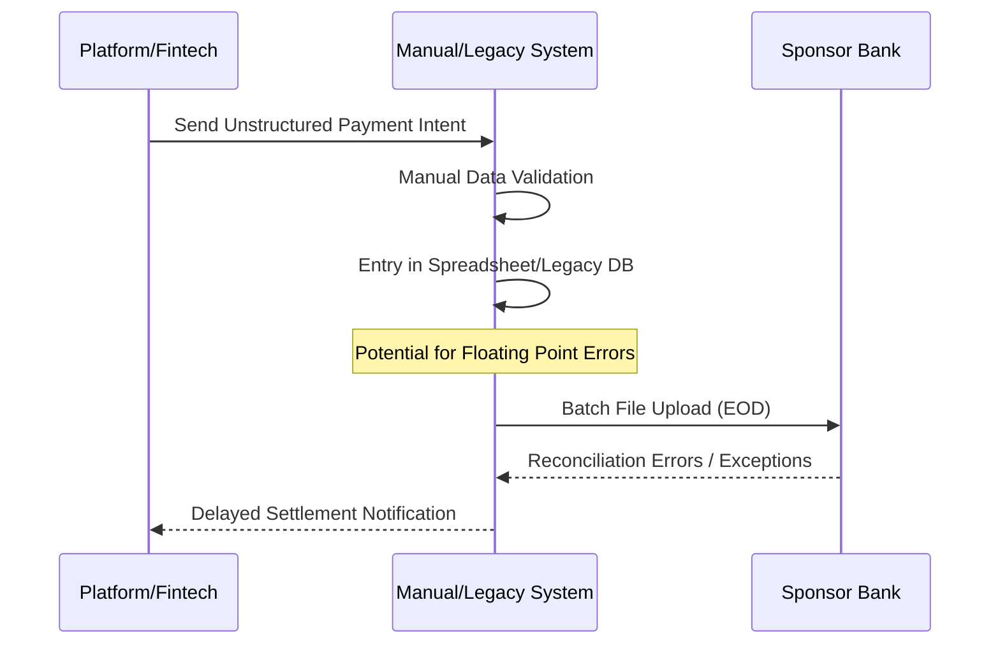
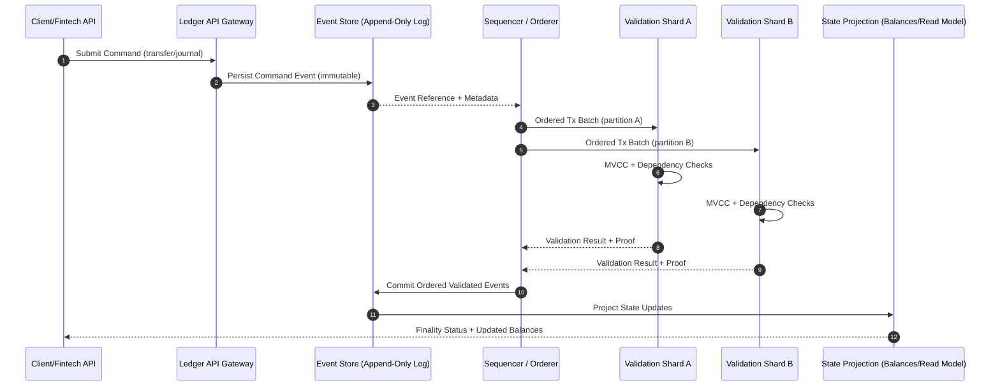

# Business Process Analysis (BPA) Report: Neobank Ledger API

## 1. Introduction and Context

### Project Objectives
The objective of this project is to instantiate a high-integrity, B2B-grade ledger system that serves as a "common semantic layer" for Banking-as-a-Service (BaaS) architectures. 
- **Integrity**: Ensure 100% transaction accuracy using double-entry bookkeeping.
- **Auditability**: Provide evidence-grade logging to satisfy regulatory mandates (e.g., FDIC custodial account requirements).
- **Automation**: Enable Straight-Through Processing (STP) to eliminate manual reconciliation gaps.

### Scope
The system covers the internal ledgering of funds within a Neobank ecosystem, including Account management, Journal Entry instantiation, and Balance verification. 
- **In-Scope**: Digital ledgering, double-entry validation, balance management, and metadata extensibility.
- **Out-of-Scope**: Physical payment rail execution (Fedwire/RTGS), Customer KYC/Onboarding, and front-end UI.

### Stakeholders & Ecosystem
The ecosystem is evolving from solitary institutional silos to federated platform networks. The primary relationships map as follows:
- **Sponsor Banks & Central Authorities**: Serve as the foundational trust anchors and regulatory interfaces. They are evolving into platforms (Banking-as-a-Platform) for external integration and visibility into the "system of record" ([[alfhaili_2025|Alfhaili et al., 2025]]; [[huang_2024|Huang et al., 2024]]; [[renduchintala_2022|Renduchintala et al., 2022]]).
- **Fintech Corporations & Third-Party Providers (TPPs)**: Agile platforms acting as innovators and intermediaries, executing specialized roles such as Payment Initiation Service Providers (PISPs). They launch neobanks that require modular infrastructure and frequently rely on sponsor banks for regulatory cover and capital buffering ([[walker_2023|Walker et al., 2023]]; [[bamakan_2020|Bamakan et al., 2020]]).
- **SMEs & Corporate Consumers**: End-users who demand transparent, fast, and unbundled financial services. They suffer most from current "As-Is" settlement delays and high transaction costs under various consensus/sharding trade-offs ([[fatorachian_2025|Fatorachian et al., 2025]]; [[singh_2022|Singh et al., 2022]]; [[nasir_2022|Nasir et al., 2022]]).
- **Regulators & Auditors**: Critical actors enforcing safety and soundness (FDIC, EBA, ISO 20022), transitioning from post-hoc manual verifiers to real-time compliance monitors using machine-readable standards and accountability schemes like reputation-based witness selection ([[boukhatmi_2025|Boukhatmi & Van Opstal, 2025]]; [[mashiko_2025|Mashiko et al., 2025]]; [[wang_2025|Wang et al., 2025]]; [[mohsenzadeh_2022|Mohsenzadeh et al., 2022]]; [[noreen_2023|Noreen et al., 2023]]).

## 2. Analysis of the Current State (As-Is)

### Foundational Logic (As-Is)
Despite the shift toward distributed architectures, the automated transaction lifecycle relies on formalizing logic heavily influenced by legacy constraints. Current manual or legacy-based processes involve high degrees of "exception handling" due to unstructured data. The traditional lifecycle operates as follows:
1. **Intent (Transaction Initiation)**: Triggered by user platforms or APIs, often facing high friction due to decentralized identity and KYC/AML verification requirements ([[cisar_2025|Cisar et al., 2025]]).
2. **Validation (Consensus & Verification)**: Requires consensus and adherence to strict access controls to overcome the "trust deficit" between non-affiliated parties ([[quamara_2024|Quamara et al., 2024]]; [[rage_2022|Rage et al., 2022]]).
3. **Journaling (Data Recording)**: Moves from siloed double-entry databases to shared, immutable, append-only logs ensuring system-wide state consistency ([[fulbier_2023|Fülbier & Sellhorn, 2023]]).
4. **Settlement**: The finalization of state, previously taking multiple days (often T+2), now aiming for near real-time execution via smart contracts, though frequently constrained by network latency and cross-ledger interoperability barriers ([[cisar_2025|Cisar et al., 2025]]; [[quamara_2024|Quamara et al., 2024]]).

### "As-Is" Process Map

### Data Inventory
Current "As-Is" data often lacks structure, but the transition to ISO 20022 mandates:
- **Account ID**: Unique identifier.
- **Amount**: Often stored as floats (Error source); must transition to Integers.
- **Currency**: ISO 4217 code.
- **Timestamps**: Event creation/update.

### Pain Points (System Entropy)
The researched domain presents several critical risks and inefficiencies:
- **Nth-Party Risk & Accountability Gaps**: As ecosystems expand, accountability gaps emerge where autonomous agents or intermediate service providers may introduce vulnerabilities or incorrect data without immediate traceability ([[boukhatmi_2025|Boukhatmi & Van Opstal, 2025]]).
- **Reconciliation Gaps & Latency**: Legacy sequential models induce the "bullwhip effect" in data distribution, causing mismatches across isolated organizational ledgers and requiring extensive manual resolution ([[alt_2025|Alt & Gräser, 2025]]; [[seshadrinathan_2025|Seshadrinathan & Chandra, 2025]]).
- **Data Integrity & Privacy Loss**: The tension between the transparency requirement of ledgers and business confidentiality introduces mapping uncertainty, information overload, and regulatory exposure ([[alfhaili_2025|Alfhaili et al., 2025]]; [[fulbier_2023|Fülbier & Sellhorn, 2023]]).
- **Scalability, Technical Bottlenecks & Floating Point Errors**: Inaccuracy in multi-currency rounding and high transaction confirmation latency. Contract vulnerabilities and linear storage growth limit the throughput in high-frequency B2B contexts where orphan blocks or propagation limits occur ([[huang_2024|Huang et al., 2024]]; [[madlberger_2025|Madlberger et al., 2025]]; [[wu_2022|Wu et al., 2022]]; [[fan_2025|Fan et al., 2025]]; [[wang_2024|Wang et al., 2024]]).

## 3. Gap Analysis
- **Current (As-Is)**: Measured in quarters for launch; manual exception handling; unstructured messaging.
- **Future (To-Be)**: Measured in weeks for launch; Straight-Through Processing (STP); ISO 20022 structured data.
- **Improvement Opportunity**: Automate the "Accounting Equation" validation (Debits = Credits) at the API level.

## 4. System Requirements & Business Rules
To build a robust, high-transaction B2B Ledger, the architecture must strictly enforce the following non-negotiable principles:
- **Double-Entry Balance**: Every transaction must maintain perfect equilibrium between debits and credits; the dual-entry axiom remains the unbreakable core of all financial systems ([[fulbier_2023|Fülbier & Sellhorn, 2023]]; [[mashiko_2025|Mashiko et al., 2025]]).
- **Immutability & Cryptographic Provenance**: An append-only historical record is mandatory to ensure tamper-resistance and facilitate automated auditing; Merkle committing and cryptographically chaining remain non-negotiable anchors ([[alt_2025|Alt & Gräser, 2025]]; [[rage_2022|Rage et al., 2022]]; [[wang_2024|Wang et al., 2024]]; [[kottursamy_2023|Kottursamy et al., 2023]]).
- **Integer Precision**: To prevent fractional data loss and rounding errors, financial quantities must be managed using integer arithmetic ([[huang_2024|Huang et al., 2024]]).
- **Explicit Finality Model**: The platform must declare if settlement is probabilistic or deterministic, including expected confirmation windows and fork-handling policy for operational and regulatory certainty ([[bouraga_2021|Bouraga, 2021]]; [[kahmann_2023|Kahmann et al., 2023]]).
- **Conflict-Aware Ordering for Throughput**: The ordering layer must detect dependency conflicts (read/write, anti-dependency, stale reads), prevent dangerous cycles, and abort or reschedule conflicting transactions before commit to avoid invalid-block waste at scale ([[wu_2026|Wu et al., 2026]]; [[liao_2026|Liao et al., 2026]]).
- **Cross-Shard Atomicity & State Coherence**: If the architecture is sharded, cross-shard operations must preserve atomicity and consistency through explicit protocols (e.g., 2PC/2PL, root-chain validation, or validation-shard merge) with resilience against shard takeover and hotspot concentration ([[li_2023a|Yi Li et al., 2023]]; [[ding_2025|Ding et al., 2025]]; [[chen_2019|Chen & Wang, 2019]]; [[yu_2023|Yu et al., 2023]]).
- **Decentralized Validation & Synchronization**: State changes must be validated systematically to ensure synchronous data replication and prevent single points of failure ([[li_2023|Li et al., 2023]]; [[li_2023a|Yi Li et al., 2023]]; [[wu_2022|Wu et al., 2022]]).
- **Regulatory Compliance by Design**: Architecture must incorporate identity management and data protection protocols natively ([[boukhatmi_2025|Boukhatmi & Van Opstal, 2025]]; [[fatorachian_2025|Fatorachian et al., 2025]]).

## 5. Technical Architecture & "To-Be" Model

### 5.1 Architectural Posture
The "To-Be" state combines an **Event Sourcing** ledger core with a **sharded execution model** and a **Fabric-like Execute-Order-Validate (EOV)** pipeline. Commands are accepted as immutable business events, ordered by a sequencer/orderer service (often via root-chain Merkle DAGs), validated for conflicts and policy, and appended to an immutable log that continuously materializes query-ready state views ([[kahmann_2023|Kahmann et al., 2023]]; [[wu_2026|Wu et al., 2026]]; [[li_2023a|Yi Li et al., 2023]]; [[zhang_2026|Zhang et al., 2026]]; [[conti_2022|Conti et al., 2022]]).

### 5.2 To-Be Flow (Event Sourcing + Shards + Fabric-like EOV)
1. **Command & Intent Capture**: API command is authenticated, normalized to structured event payload, and checked for schema/compliance gates.
2. **Execute (Pre-Validation)**: Candidate transaction effects are simulated against current versioned state to build read/write sets.
3. **Order (Sequencer)**: Transactions are globally ordered by the sequencer with deterministic metadata for replay and audit.
4. **Validate (Shard / Conflict Control)**: Validation shards apply MVCC-style checks, conflict dependency rules, and cross-shard atomicity controls before commit.
5. **Append & Materialize**: Accepted transactions are appended to the immutable event log and projected to account balances / reporting views for low-latency reads.
6. **Settle & Observe**: Finality status, audit proofs, and exception signals are emitted for operational monitoring and regulator-facing evidence trails ([[bouraga_2021|Bouraga, 2021]]; [[ding_2025|Ding et al., 2025]]; [[wu_2026|Wu et al., 2026]]).

### 5.3 "To-Be" Sequence Diagram

---
*Note: Sections 6 and 7 (Detailed To-Be and Metrics) will be populated as research progresses.*
