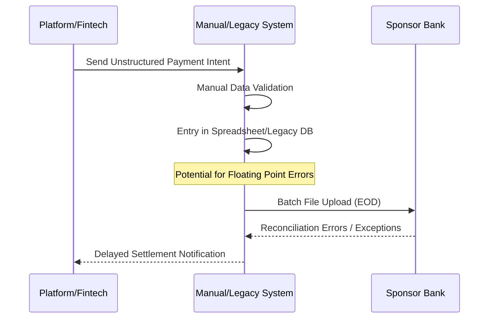

# Business Process Analysis (BPA) Report: Neobank Ledger API

## 1. Introduction and Context

### Project Objectives
The objective of this project is to instantiate a high-integrity, B2B-grade ledger system that serves as a "common semantic layer" for Banking-as-a-Service (BaaS) architectures. 
- **Integrity**: Ensure 100% transaction accuracy using double-entry bookkeeping.
- **Auditability**: Provide evidence-grade logging to satisfy regulatory mandates (e.g., FDIC custodial account requirements).
- **Automation**: Enable Straight-Through Processing (STP) to eliminate manual reconciliation gaps.

### Scope
The system covers the internal ledgering of funds within a Neobank ecosystem, including Account management, Journal Entry instantiation, and Balance verification. 
- **In-Scope**: Digital ledgering, double-entry validation, balance management, and metadata extensibility.
- **Out-of-Scope**: Physical payment rail execution (Fedwire/RTGS), Customer KYC/Onboarding, and front-end UI.

### Stakeholders
- **Sponsor Banks**: Provide the regulated balance sheet and require visibility into the "system of record."
- **Fintech Corporations**: Agile platforms launching neobanks that require modular infrastructure.
- **SMEs & Large Enterprises**: End-users demanding embedded financial dashboards and ERP integration.
- **Regulators**: Enforce safety and soundness (FDIC, EBA, ISO 20022).

## 2. Analysis of the Current State (As-Is)

### "As-Is" Process Map
Current manual or legacy-based processes involve high degrees of "exception handling" due to unstructured data.

### Data Inventory
Current "As-Is" data often lacks structure, but the transition to ISO 20022 mandates:
- **Account ID**: Unique identifier.
- **Amount**: Often stored as floats (Error source); must transition to Integers.
- **Currency**: ISO 4217 code.
- **Timestamps**: Event creation/update.

### Pain Points (System Entropy)
- **Reconciliation Gap**: Latency between platform intent and bank record.
- **Data Integrity Degradation**: Information loss across intermediaries without evidence-grade logging.
- **Floating Point Errors**: Inaccuracy in multi-currency or high-volume rounding.
- **Regulatory Risk**: Failure to provide a "direct transactional system of record" for custodial accounts.

## 3. Gap Analysis
- **Current (As-Is)**: Measured in quarters for launch; manual exception handling; unstructured messaging.
- **Future (To-Be)**: Measured in weeks for launch; Straight-Through Processing (STP); ISO 20022 structured data.
- **Improvement Opportunity**: Automate the "Accounting Equation" validation (Debits = Credits) at the API level.

## 4. Future State Proposal (To-Be) - Preliminary

### New Process Flow (BaaS API Orchestration)
1. **Authentication**: Validate API credentials.
2. **Account/Balance Check**: Ensure liquidity.
3. **Balanced Journal Entry**: Create a set of debits/credits that sum to zero.
4. **Immutability Enforcement**: Append-only records to prevent deletion/modification.

---
*Note: Sections 5 and 6 (Detailed To-Be and Metrics) will be populated as research progresses.*
