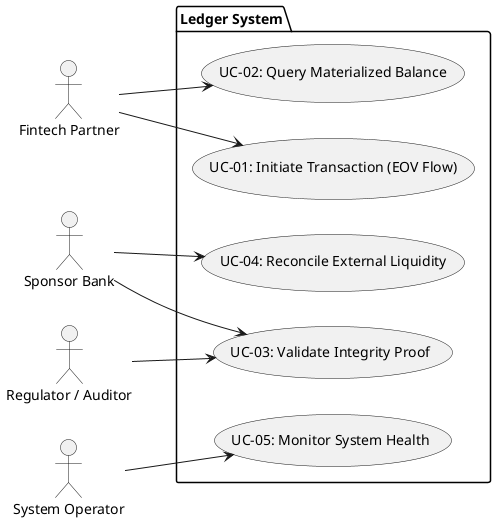

# Use Case Specifications: Ledger API

This document replaces the earlier high-level draft and formalizes the actor goals and system behaviors needed before Functional Requirements are derived.

## Source Basis
- BPA Report v1.2: Sections 1, 4.1, 5.1, 5.2, and 7.1.
- BPMN extraction notes: `docs/02_analysis/requirements/bpmn/actors-stakeholders.md` and `docs/02_analysis/requirements/bpmn/processes.md`.
- Research artifacts in `docs/02_analysis/research/` were used only where the BPA and BPMN notes were not explicit enough.

## Actor Naming Baseline
| Actor                     | Meaning                                                                |
| :------------------------ | :--------------------------------------------------------------------- |
| **Fintech Partner (TPP)** | External business actor that initiates or queries ledger operations.   |
| **Sponsor Bank**          | Trust anchor, settlement overseer, and reconciliation authority.       |
| **Auditor / Regulator**   | Compliance actor that verifies integrity and evidence.                 |
| **System Operator**       | Technical operator responsible for system availability and monitoring. |

## Use Case Diagram

## UC-01: Initiate Transaction (EOV Flow)

| **Element**                 | **Detail**                                                                                                                                                                                                                                                                                                                                                                                                                                                                                                                                                                                                                                                                                                                                                                                    |
| :-------------------------- | :-------------------------------------------------------------------------------------------------------------------------------------------------------------------------------------------------------------------------------------------------------------------------------------------------------------------------------------------------------------------------------------------------------------------------------------------------------------------------------------------------------------------------------------------------------------------------------------------------------------------------------------------------------------------------------------------------------------------------------------------------------------------------------------------- |
| **ID**                      | UC-01                                                                                                                                                                                                                                                                                                                                                                                                                                                                                                                                                                                                                                                                                                                                                                                         |
| **Name**                    | Initiate Transaction (EOV Flow)                                                                                                                                                                                                                                                                                                                                                                                                                                                                                                                                                                                                                                                                                                                                                               |
| **Primary Actor**           | Fintech Partner (TPP)                                                                                                                                                                                                                                                                                                                                                                                                                                                                                                                                                                                                                                                                                                                                                                         |
| **Secondary Actors**        | Ledger API Gateway; Event Store; Sequencer / Orderer; Validation Shards; State Projection                                                                                                                                                                                                                                                                                                                                                                                                                                                                                                                                                                                                                                                                                                     |
| **Description**             | Accept a transaction command, validate it against account state and business rules, order it deterministically, validate shard-level conflicts, and publish the committed result into the immutable ledger and materialized views.                                                                                                                                                                                                                                                                                                                                                                                                                                                                                                                                                            |
| **Preconditions**           | - Caller is authenticated and authorized. - Command payload is structured and schema-compliant. - Amounts use integer precision. - Candidate debit and credit effects can preserve double-entry balance. - Required compliance metadata is present for downstream processing.                                                                                                                                                                                                                                                                                                                                                                                                                                                                                                     |
| **Main Flow**               | 1. The API receives the command intent from the Fintech Partner. 2. The gateway authenticates the request and normalizes it into a structured event payload. 3. The system checks schema and compliance gates before execution. 4. The Execute step simulates the candidate transaction effects against current state. 5. The Sequencer assigns a deterministic global order for replay and audit. 6. Validation shards perform conflict and dependency checks on the ordered transaction. 7. The system commits the accepted transaction by appending it to the immutable event log. 8. The system projects the committed state into account balance and reporting views. 9. Finality status and audit evidence are emitted to the caller and operational observers. |
| **Alternate Flows**         | AF-001: Schema or compliance gate rejects the command before execution. AF-002: Pre-validation fails because the simulated effects do not satisfy double-entry or policy constraints. AF-003: The Sequencer cannot assign a deterministic order within the accepted processing window. AF-004: Validation detects a conflict or dependency violation, so the transaction is not committed.                                                                                                                                                                                                                                                                                                                                                                                           |
| **Postconditions**          | - The committed transaction is written to the immutable log. - The World State / materialized view is updated. - Finality evidence is available for audit and operational monitoring. - The accounting equation remains balanced.                                                                                                                                                                                                                                                                                                                                                                                                                                                                                                                                                    |

## UC-02: Query Materialized Balance

| **Element** | **Detail** |
| :--- | :--- |
| **ID** | UC-02 |
| **Name** | Query Materialized Balance |
| **Primary Actor** | Fintech Partner (TPP) |
| **Secondary Actors** | State Projection / World State service; Event Store for lineage reference |
| **Description** | Retrieve the latest projected balance for an account from the materialized read model instead of reading the raw event log. |
| **Preconditions** | - Caller is authenticated and authorized to read the account. - The account identifier exists or can be resolved by the ledger. - The materialized view is available for querying. |
| **Main Flow** | 1. The Fintech Partner submits a balance query for a specific account. 2. The gateway validates the caller and the request format. 3. The system reads the latest projected balance from the World State. 4. The system returns the balance and any relevant query metadata. |
| **Alternate Flows** | AF-001: The account cannot be resolved, so the query returns a not-found result. AF-002: The read model is unavailable, so the system returns an unavailable status without mutating ledger data. |
| **Postconditions** | - No ledger mutation occurs. - The response reflects the latest available projected balance. - The query can be audited through the system access trail if required. |

## UC-03: Validate Integrity Proof (Hash-Chain Audit)

| **Element** | **Detail** |
| :--- | :--- |
| **ID** | UC-03 |
| **Name** | Validate Integrity Proof (Hash-Chain Audit) |
| **Primary Actor** | Sponsor Bank |
| **Secondary Actors** | Auditor / Regulator; Event Store; Hash-chain checkpoint service; Audit evidence repository |
| **Description** | Verify that the transaction history has not been tampered with by validating the signed hash-chain checkpoints and the continuity of the ledger history. |
| **Preconditions** | - The requested ledger range or checkpoint is identified. - Signed hash-chain evidence exists for the target history segment. - The caller is authorized to perform audit verification. |
| **Main Flow** | 1. The Sponsor Bank or auditor requests an integrity proof for a ledger segment. 2. The system retrieves the relevant checkpoint and historical evidence from the event log. 3. The system validates the digital signatures attached to the checkpoint material. 4. The system verifies hash-chain continuity across the selected history. 5. The system compares the proof result against the stored audit evidence. 6. The system returns an integrity verdict and records the audit result. |
| **Alternate Flows** | AF-001: The checkpoint evidence is missing or incomplete, so proof generation fails. AF-002: A signature mismatch is detected, so the integrity proof is rejected. AF-003: Hash-chain continuity breaks, so the ledger segment is marked inconsistent. |
| **Postconditions** | - An integrity verdict is recorded. - The audit trail contains the proof request and outcome. - No business state is mutated by the verification step. |

## UC-04: Reconcile External Liquidity

| **Element** | **Detail** |
| :--- | :--- |
| **ID** | UC-04 |
| **Name** | Reconcile External Liquidity |
| **Primary Actor** | Sponsor Bank |
| **Secondary Actors** | Ledger balances / World State; external RTGS or vault reference; reconciliation evidence repository |
| **Description** | Ensure that internal ledger balances match the sponsor bank’s external liquidity reference and record any mismatch as a reconciliation exception. |
| **Preconditions** | - The sponsor bank has an external reference balance or vault position available for comparison. - Internal balances are available in the materialized view. - The reconciliation request is authorized. |
| **Main Flow** | 1. The Sponsor Bank triggers or receives the reconciliation task. 2. The system reads the internal ledger balance from the World State. 3. The system reads the external liquidity reference from the sponsor-bank side. 4. The system compares the two positions. 5. The system records the reconciliation result and any mismatch evidence. 6. The system emits a reconciliation status for operational follow-up. |
| **Alternate Flows** | AF-001: The internal and external balances differ, so the system records a reconciliation exception. AF-002: The external reference is unavailable, so reconciliation remains open until the reference can be retrieved. |
| **Postconditions** | - Reconciliation status is recorded. - Mismatch evidence, if any, is preserved for follow-up. - The transaction history itself remains immutable. |

## UC-05: Monitor System Health

| **Element** | **Detail** |
| :--- | :--- |
| **ID** | UC-05 |
| **Name** | Monitor System Health |
| **Primary Actor** | System Operator |
| **Secondary Actors** | Monitoring / alerting service; Sequencer / Orderer; Validation Shards; State Projection; Event Store |
| **Description** | Observe the operational health of the ledger components, detect liveness or evidence issues, and surface actionable alerts for support and incident handling. |
| **Preconditions** | - The operator is authenticated and authorized for operational monitoring. - Telemetry and operational signals are being published by the ledger components. - The monitoring scope is configured for the active environment. |
| **Main Flow** | 1. The System Operator opens the health view or monitoring endpoint. 2. The system collects the current liveness, latency, and status signals from the ledger components. 3. The operator reviews the health of the sequencer, validation shards, event store, and state projection services. 4. The system surfaces warnings or anomalies when thresholds are exceeded. 5. The operator records the operational decision or escalates the incident if needed. |
| **Alternate Flows** | AF-001: Telemetry is unavailable, so the operator cannot complete a full health review. AF-002: A critical component fails a health check, so the system raises an incident or alert. |
| **Postconditions** | - Operational status is documented. - Alerts or incidents are created when required. - No transaction data is mutated by the monitoring action. |

## Gap Note
Any behavior that remains unsupported after checking the BPA, BPMN notes, and research artifacts is recorded in `gaps.md` rather than invented here.
