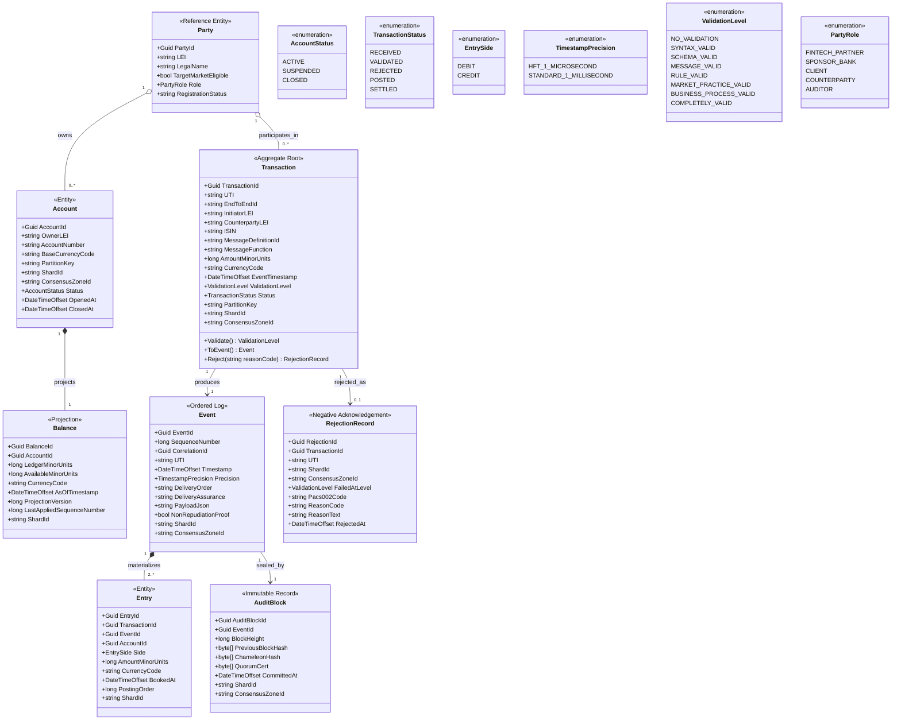
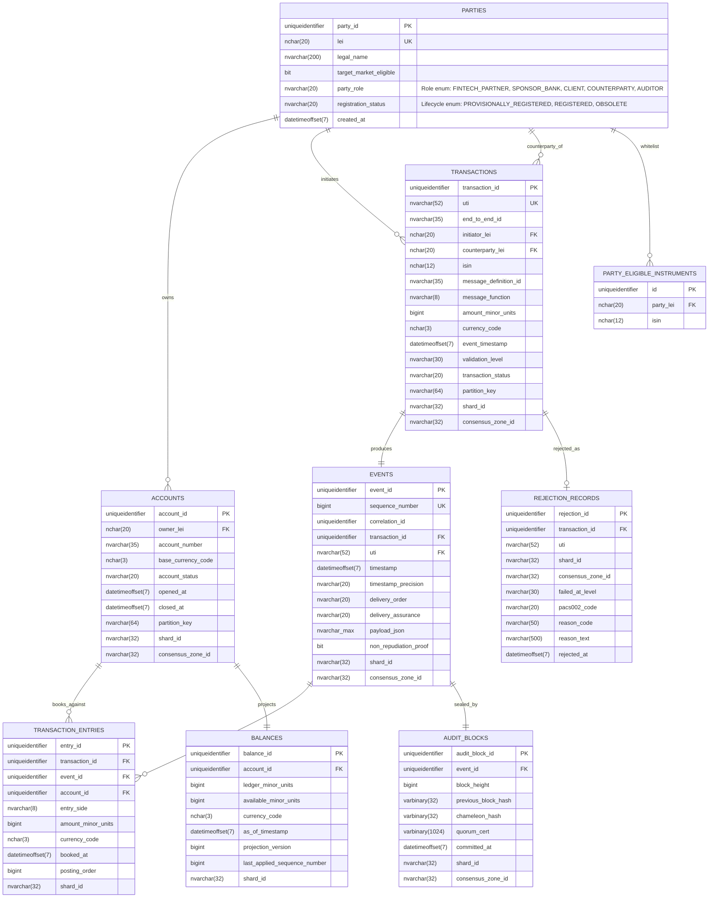

# Domain Entity Model

## 1. Purpose

This document synthesizes the ISO 20022 and MiFID II extraction notes into the canonical domain model used by the NeoBank Ledger. It is the pre-code contract between the HLD and the implementation, and it stays aligned with the service boundaries in [[High-Level-Design]]:

- Gateway for authenticated ingress and normalization.
- Ordering Service / Sequencer for global ordering and sequence assignment.
- Validation Shards for shard-local consensus and conflict checks.
- Balance Projection for the materialized read model.
- Audit Vault for immutable evidence and oversight.

The model is intentionally pre-code. It defines the business aggregates, physical storage columns, validation states, and compliance attributes that must exist before implementation begins.

## 2. Critical Synthesis

The source material describes ISO 20022 amounts as decimal-oriented logical concepts, but this ledger stores money as smallest currency units to preserve exactness across shards.

The source material also distinguishes standard and high-frequency timestamp precision under MiFID II RTS 25. This design stores timestamps as `DateTimeOffset(7)` so the physical model can preserve the highest required precision while application rules validate the reporting floor.

The two biggest cross-standard synthesis choices are therefore:

| Decision                                                 | Why it matters                                                                                                                                                                                                      | Source note                                                              |
| -------------------------------------------------------- | ------------------------------------------------------------------------------------------------------------------------------------------------------------------------------------------------------------------- | ------------------------------------------------------------------------ |
| Legal metadata is a consensus predicate                  | Gateway validation rejects missing or invalid LEI, UTI, and ISIN before sequencing. A failed command emits a `RejectionRecord` mapped to pacs.002 semantics.                                                        | MiFID II Art. 10, Recital 71; ISO 20022 validation rules                 |
| Partition routing is deterministic                       | The routing key is `OwnerLEI` for customer-owned flows, with `AccountId` used only for internal or house accounts. `ShardId` is derived from the partition key, and `ConsensusZoneId` is used by the m-node bridge. | [[ADR-003-Sharding-Topology-via-MSSP]], [[High-Level-Design]]            |
| Money is stored as smallest currency units               | Prevents rounding drift and cross-shard precision loss. Monetary values are persisted as `BIGINT` plus explicit `CHAR(3)` currency codes.                                                                           | ISO 20022 Part 4, ledger precision policy                                |
| Audit-critical timestamps use UTC `DateTimeOffset(7)`    | Preserves enough precision for RTS 25 reporting and deterministic ordering while normalizing every persisted timestamp to UTC Z.                                                                                    | MiFID II RTS 25                                                          |
| Balance is a projection with versioning                  | `ProjectionVersion` and `LastAppliedSequenceNumber` prevent stale reads under high throughput and support replay-safe materialization.                                                                              | BPA 5.2 To-Be Flow                                                       |
| The audit layer must preserve finality and redactability | `PreviousBlockHash`, `ChameleonHash`, and `QuorumCert` preserve chain continuity, authorized redaction capability, and deterministic finality.                                                                      | [[ADR-001-GDPR-Compliance]], [[ADR-002-Deterministic-Finality-via-PBFT]] |
| The shard bridge must remain lightweight                 | The MSSP topology uses a 20%-25% m-node ratio to carry cross-shard proofs without introducing a separate 2PC service.                                                                                               | [[ADR-003-Sharding-Topology-via-MSSP]]                                   |
| Failure is first-class                                   | Invalid commands produce a `RejectionRecord` instead of disappearing into the control plane. This keeps operational failure, legal failure, and audit failure visible in the same model.                            | ISO 20022 negative acknowledgement flow, ledger ingress policy           |
| Party eligibility is reference data                      | LEI registry checks and ISIN whitelists are modeled explicitly so target market and counterparty rules can be enforced before the event is sequenced.                                                               | MiFID II Art. 10, Recital 71                                             |

## 3. Gateway Validation Sequence

Ingress validation is modeled as an eight-state progression. Anything below `COMPLETELY_VALID` is rejected and captured as a `RejectionRecord`.

| Level | State                  | Gate                                                                            |
| ----- | ---------------------- | ------------------------------------------------------------------------------- |
| 1     | NO_VALIDATION          | Raw ingress captured, but not trusted.                                          |
| 2     | SYNTAX_VALID           | Payload is well formed and encoded correctly.                                   |
| 3     | SCHEMA_VALID           | Schema and structural constraints pass.                                         |
| 4     | MESSAGE_VALID          | Mandatory message fields and identifiers are present.                           |
| 5     | RULE_VALID             | Legal entity and instrument rules pass, including LEI registry and ISIN checks. |
| 6     | MARKET_PRACTICE_VALID  | Target market, venue, and regulatory practice checks pass.                      |
| 7     | BUSINESS_PROCESS_VALID | Choreography, idempotency, and double-entry rules pass.                         |
| 8     | COMPLETELY_VALID       | All rules pass and the command may be sequenced.                                |

Default rejection policy is `REJECT`. `REJECT_AND_DELIVER` is only allowed where a shard-owned exception path explicitly requires it.

## 4. Domain Model Diagram

### Domain Traceability Notes

| Entity          | Role in the ledger                                                               | Source note                                                              |
| --------------- | -------------------------------------------------------------------------------- | ------------------------------------------------------------------------ |
| Party           | Reference data for LEI registry, target market eligibility, and whitelist checks | MiFID II Art. 10, Recital 71                                             |
| Account         | Business anchor for balance ownership and shard partitioning                     | ISO 20022 composite aggregation rule; BPA 5.2                            |
| Transaction     | Intake aggregate root and legal record of intent                                 | ISO 20022 business transaction rules; MiFID II reporting                 |
| Event           | Ordered immutable log produced by the sequencer                                  | HLD sequencing flow; ISO 20022 delivery order rules                      |
| Entry           | Double-entry line item and immutable posting record                              | ISO 20022 business element rules; BPA 5.2                                |
| Balance         | Materialized read model derived from validated entries                           | BPA 5.2 Conceptual Static / Balance Projection                           |
| AuditBlock      | Immutable evidence bundle and hash-chain anchor                                  | [[ADR-001-GDPR-Compliance]], [[ADR-002-Deterministic-Finality-via-PBFT]] |
| RejectionRecord | Negative acknowledgement for failed validation or compliance checks              | ISO 20022 rejection semantics; pacs.002 mapping                          |

## 5. Entity-Relationship Diagram

### Controlled Vocabulary Constraints

The ERD fields below are backed by explicit allowed-value constraints so status columns do not drift into open text.

| Column                              | Allowed Values / Constraint                                                                                                                           |
| ----------------------------------- | ----------------------------------------------------------------------------------------------------------------------------------------------------- |
| `PARTIES.party_role`                | `FINTECH_PARTNER`, `SPONSOR_BANK`, `CLIENT`, `COUNTERPARTY`, `AUDITOR`                                                                                |
| `PARTIES.registration_status`       | `PROVISIONALLY_REGISTERED`, `REGISTERED`, `OBSOLETE`                                                                                                  |
| `ACCOUNTS.account_status`           | `ACTIVE`, `SUSPENDED`, `CLOSED`                                                                                                                       |
| `TRANSACTIONS.transaction_status`   | `RECEIVED`, `VALIDATED`, `REJECTED`, `POSTED`, `SETTLED`                                                                                              |
| `TRANSACTIONS.validation_level`     | `NO_VALIDATION`, `SYNTAX_VALID`, `SCHEMA_VALID`, `MESSAGE_VALID`, `RULE_VALID`, `MARKET_PRACTICE_VALID`, `BUSINESS_PROCESS_VALID`, `COMPLETELY_VALID` |
| `TRANSACTIONS.message_function`     | `NEWM`, `CANC`                                                                                                                                        |
| `EVENTS.timestamp_precision`        | `HFT_1_MICROSECOND`, `STANDARD_1_MILLISECOND`                                                                                                         |
| `EVENTS.delivery_order`             | `FIFO_ORDERED`, `EXPECTED_CAUSAL_ORDER`                                                                                                               |
| `EVENTS.delivery_assurance`         | `EXACTLY_ONCE`                                                                                                                                        |
| `TRANSACTION_ENTRIES.entry_side`    | `DEBIT`, `CREDIT`                                                                                                                                     |
| `BALANCES.registration_status`      | `REGISTERED`, `OBSOLETE`                                                                                                                              |
| `AUDIT_BLOCKS.registration_status`  | `REGISTERED`, `OBSOLETE`                                                                                                                              |
| `AUDIT_BLOCKS.change_type`          | `CREATE`, `AMEND`, `DELETE`                                                                                                                           |
| `REJECTION_RECORDS.failed_at_level` | Same domain as `TRANSACTIONS.validation_level`                                                                                                        |

### Physical Column Traceability

| Entity.Column                          | Physical type     | Source note                                  | Critical synthesis                                            |
| -------------------------------------- | ----------------- | -------------------------------------------- | ------------------------------------------------------------- |
| PARTIES.lei                            | nchar(20)         | MiFID II Art. 10 / ISO 17442                 | Legal entity identity anchor                                  |
| PARTIES.target_market_eligible         | bit               | MiFID II Recital 71                          | Controls whitelist and eligibility checks                     |
| PARTY_ELIGIBLE_INSTRUMENTS.isin        | nchar(12)         | MiFID II Recital 71                          | Instrument whitelist entry                                    |
| ACCOUNTS.owner_lei                     | nchar(20)         | MiFID II Art. 10 / 16.3                      | Legal entity ownership anchor                                 |
| ACCOUNTS.partition_key                 | nvarchar(64)      | Shard routing policy                         | Deterministic shard routing by OwnerLEI or fallback AccountId |
| ACCOUNTS.shard_id                      | nvarchar(32)      | [[ADR-003-Sharding-Topology-via-MSSP]]       | Physical shard placement                                      |
| TRANSACTIONS.uti                       | nvarchar(52)      | MiFID II Art. 16.7                           | Unique transaction identifier                                 |
| TRANSACTIONS.initiator_lei             | nchar(20)         | MiFID II Art. 10                             | Initiating legal entity                                       |
| TRANSACTIONS.counterparty_lei          | nchar(20)         | MiFID II Art. 10 / Recital 71                | Counterparty legal entity                                     |
| TRANSACTIONS.isin                      | nchar(12)         | MiFID II Recital 71                          | Instrument eligibility and target market checks               |
| TRANSACTIONS.partition_key             | nvarchar(64)      | Shard routing policy                         | Deterministic routing for ingress and replay                  |
| TRANSACTIONS.shard_id                  | nvarchar(32)      | [[ADR-003-Sharding-Topology-via-MSSP]]       | Stores the assigned shard at ingress                          |
| TRANSACTIONS.consensus_zone_id         | nvarchar(32)      | [[ADR-003-Sharding-Topology-via-MSSP]]       | Tracks the zone used by the m-node bridge                     |
| TRANSACTIONS.validation_level          | nvarchar(30)      | ISO 20022 validation sequence                | Records the highest validation gate reached                   |
| TRANSACTIONS.amount_minor_units        | bigint            | ISO 20022 Amount + ledger precision policy   | Stored as smallest currency unit                              |
| TRANSACTIONS.event_timestamp           | datetimeoffset(7) | MiFID II RTS 25                              | Deterministic temporal ordering in UTC Z                      |
| EVENTS.sequence_number                 | bigint            | Sequencer ordering rule                      | Global monotonic event order                                  |
| EVENTS.delivery_order                  | nvarchar(20)      | ISO 20022 delivery order rules               | FIFO / causal ordering trace                                  |
| EVENTS.delivery_assurance              | nvarchar(20)      | ISO 20022 delivery assurance rules           | Exactly-once delivery contract                                |
| EVENTS.payload_json                    | nvarchar(max)     | Normalized business payload                  | Immutable event body for audit and replay                     |
| EVENTS.non_repudiation_proof           | bit               | ISO 20022 non-repudiation rules              | Proof that the event was accepted and signed                  |
| TRANSACTION_ENTRIES.amount_minor_units | bigint            | ISO 20022 Amount + serialization constraints | Immutable ledger line value                                   |
| TRANSACTION_ENTRIES.booked_at          | datetimeoffset(7) | MiFID II RTS 25                              | Posting timestamp in UTC Z                                    |
| BALANCES.ledger_minor_units            | bigint            | BPA 5.2 balance projection                   | Ledger-side projection total                                  |
| BALANCES.available_minor_units         | bigint            | BPA 5.2 balance projection                   | Available spendable projection                                |
| BALANCES.projection_version            | bigint            | Projection versioning rule                   | Stale-read defense for high-frequency throughput              |
| BALANCES.last_applied_sequence_number  | bigint            | Sequencer ordering rule                      | Replay-safe projection updates                                |
| BALANCES.as_of_timestamp               | datetimeoffset(7) | MiFID II RTS 25                              | Projection freshness timestamp                                |
| AUDIT_BLOCKS.previous_block_hash       | varbinary(32)     | Hash-chain audit trail                       | Chain continuity                                              |
| AUDIT_BLOCKS.chameleon_hash            | varbinary(32)     | [[ADR-001-GDPR-Compliance]]                  | Redactable integrity anchor                                   |
| AUDIT_BLOCKS.quorum_cert               | varbinary(1024)   | [[ADR-002-Deterministic-Finality-via-PBFT]]  | Finality proof artifact                                       |
| AUDIT_BLOCKS.committed_at              | datetimeoffset(7) | MiFID II RTS 25 / audit trail                | Commit timestamp                                              |
| REJECTION_RECORDS.pacs002_code         | nvarchar(20)      | ISO 20022 negative acknowledgement mapping   | Standard failure code for rejected commands                   |
| REJECTION_RECORDS.failed_at_level      | nvarchar(30)      | Validation sequence                          | Records where the command stopped                             |
| REJECTION_RECORDS.rejected_at          | datetimeoffset(7) | MiFID II RTS 25                              | Time the rejection became observable                          |

## 6. Compliance Attribute List

| Compliance field          | Type              | Used by                                                                  | Source note                                      | Why it is present                                              |
| ------------------------- | ----------------- | ------------------------------------------------------------------------ | ------------------------------------------------ | -------------------------------------------------------------- |
| UTI                       | nvarchar(52)      | Transaction, Event, RejectionRecord                                      | MiFID II Art. 16.7                               | Tracks the transaction through reporting and audit             |
| LEI                       | nchar(20)         | Party, Account, Transaction                                              | MiFID II Art. 10 / 16.3                          | Identifies the legal entity responsible for the message        |
| ISIN                      | nchar(12)         | Transaction, Party whitelist                                             | MiFID II Recital 71                              | Preserves instrument eligibility and target market checks      |
| EndToEndID                | nvarchar(35)      | Transaction                                                              | ISO 20022 message traceability                   | Preserves end-to-end business correlation                      |
| CurrencyAmount            | bigint + nchar(3) | Transaction, Entry, Balance                                              | ISO 20022 amount semantics + storage constraints | Keeps monetary values exact and currency-explicit              |
| Timestamp                 | datetimeoffset(7) | Transaction, Event, Entry, AuditBlock, Balance, RejectionRecord          | MiFID II RTS 25                                  | Supports reporting precision and deterministic ordering        |
| ShardId                   | nvarchar(32)      | Transaction, Event, Entry, Balance, Account, AuditBlock, RejectionRecord | [[ADR-003-Sharding-Topology-via-MSSP]]           | Captures deterministic routing and physical placement          |
| ConsensusZoneId           | nvarchar(32)      | Event, AuditBlock, RejectionRecord                                       | [[ADR-003-Sharding-Topology-via-MSSP]]           | Tracks the consensus zone used by the bridge                   |
| ChameleonHash             | varbinary(32)     | AuditBlock                                                               | [[ADR-001-GDPR-Compliance]]                      | Enables authorized redaction without breaking chain continuity |
| QuorumCert                | varbinary(1024)   | AuditBlock                                                               | [[ADR-002-Deterministic-Finality-via-PBFT]]      | Proves shard-group finality                                    |
| ProjectionVersion         | bigint            | Balance                                                                  | Projection versioning rule                       | Prevents stale reads                                           |
| LastAppliedSequenceNumber | bigint            | Balance                                                                  | Sequencer ordering rule                          | Supports replay-safe projection updates                        |
| Pacs002Code               | nvarchar(20)      | RejectionRecord                                                          | ISO 20022 negative acknowledgement mapping       | Standardizes the failure path                                  |
| ValidationLevel           | nvarchar(30)      | Transaction, RejectionRecord                                             | ISO 20022 validation sequence                    | Records the highest gate passed or failed                      |

## 7. Final Design Notes

- ISO 20022 provides the logical grammar; this document translates that grammar into the ledger's business entities and physical columns.
- The model intentionally keeps transport-only headers and observability-only logs out of the persistent core unless they affect legal state.
- The Balance Projection is derived from validated entries, so it remains a read model and not a second source of truth.
- The Audit Vault is the immutable evidence layer and the only place where redactability, finality proofs, and audit traces converge.
- The shard topology assumes the 20%-25% m-node bridge ratio from [[ADR-003-Sharding-Topology-via-MSSP]] and routes commands through `ShardId` and `ConsensusZoneId` for deterministic replay.
- The archived source drafts live under `docs/00_meta/archive/architecture_drafts/` and are no longer the canonical reference for the domain model.
