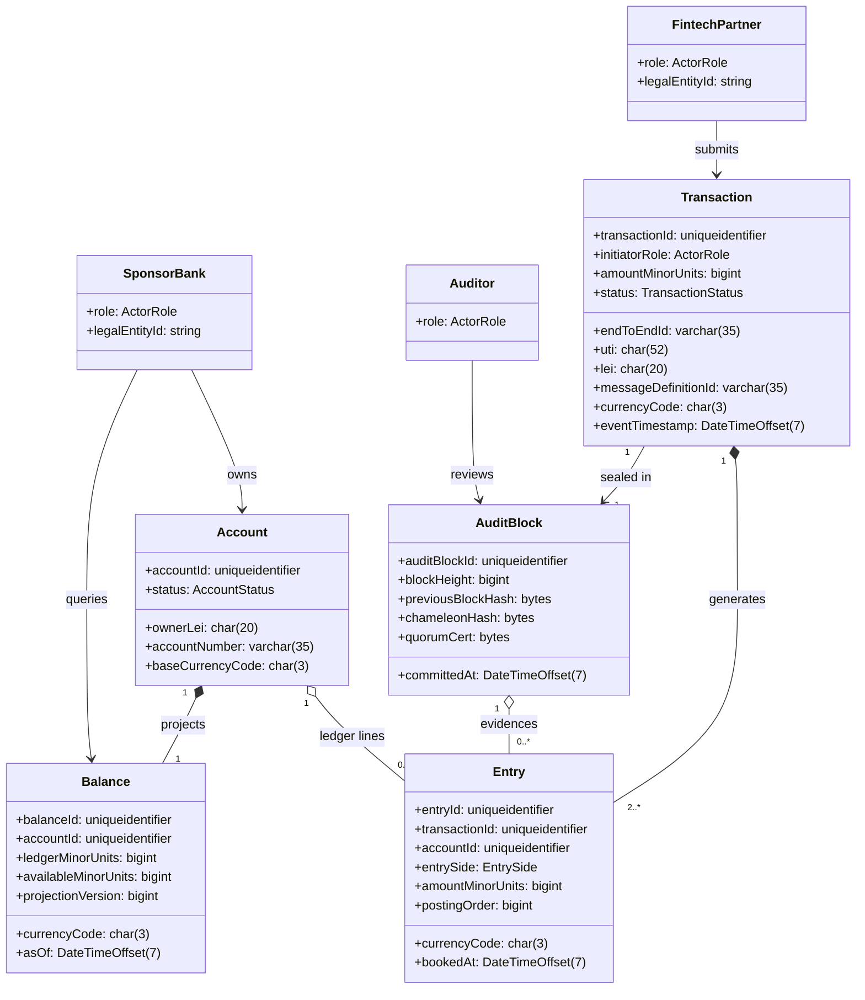
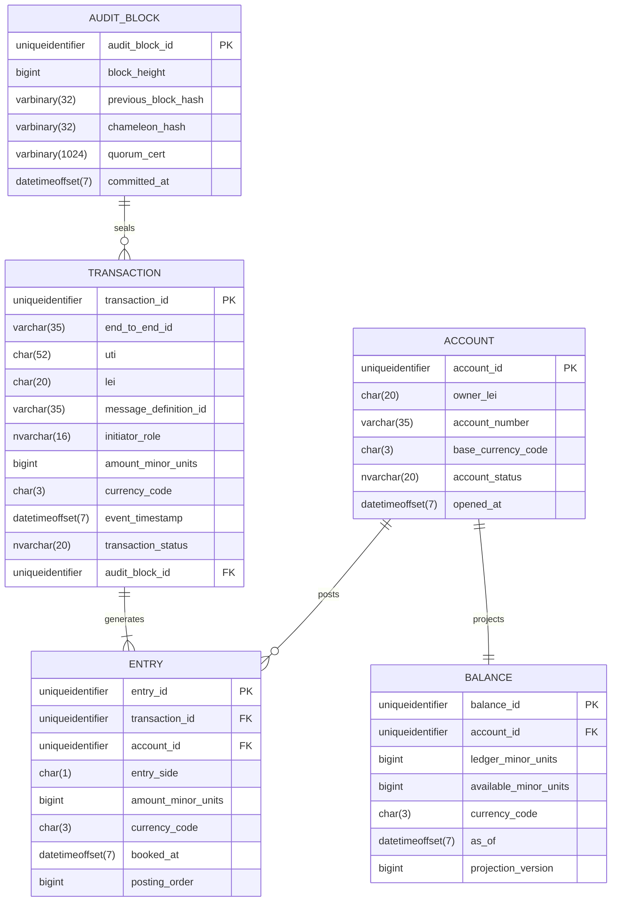

# Domain Entity Model

## 1. Purpose
This document synthesizes the ISO 20022 and MiFID II extraction notes into the domain model used by the NeoBank Ledger. It maps the ledger's business language to the service-level architecture already established in the HLD:
- Gateway for authenticated ingress and normalization.
- Ordering Service / Sequencer for global ordering.
- Validation Shards for shard-local consensus and conflict checks.
- Balance Projection for the materialized read model.
- Audit Vault for immutable evidence and oversight.

The model is intentionally pre-code. It defines the business aggregates, physical storage columns, and compliance attributes that must exist before implementation begins.

## 2. Critical Synthesis

The source material describes ISO 20022 Amount as a decimal-oriented logical concept, but this ledger stores money as smallest currency units to preserve exactness across shards.

The source material also distinguishes standard and high-frequency timestamp precision under MiFID II RTS 25. This design stores timestamps as `DateTimeOffset(7)` so the physical model can preserve the highest required precision while application rules validate the reporting floor.

The two biggest cross-standard synthesis choices are therefore:

| Decision | Why it matters | Source note |
| --- | --- | --- |
| Money is stored as smallest currency units instead of floating point or decimal arithmetic in the database | Prevents rounding drift and cross-shard precision loss | Source: ISO 20022 Part 4 (Amount), ledger precision policy |
| Audit-critical timestamps use `DateTimeOffset(7)` | Preserves enough precision for RTS 25 reporting and deterministic ordering | Source: MiFID II RTS 25, ISO 20022 Part 4 |
| `Balance` is a projection, not the source of truth | Keeps the read model separate from the immutable log | Source: BPA 5.2 To-Be Flow |
| `AuditBlock` carries `ChameleonHash` and `QuorumCert` | Anchors redactability and deterministic finality in the audit layer | Source: ADR-001 and ADR-002 |

## 3. Domain Model Diagram

### Domain Traceability Notes

| Entity | Role in the ledger | Source note |
| --- | --- | --- |
| FintechPartner | External originator of commands | Source: BPA stakeholder map and HLD ingress flow |
| SponsorBank | External party that owns accounts and queries balances | Source: BPA stakeholder map and UC-04 / UC-05 context |
| Auditor | Passive reviewer of immutable evidence | Source: BPA 1.3 and audit-vault requirements |
| Account | Business anchor for balance ownership | Source: ISO 20022-2 composite aggregation rule; BPA 5.2 |
| Transaction | Intake aggregate root and legal record of intent | Source: ISO 20022 BusinessTransaction / MiFID II reporting |
| Entry | Double-entry line item and immutable event record | Source: ISO 20022 BusinessElement rules and BPA 5.2 |
| Balance | Materialized read model derived from validated entries | Source: BPA 5.2 Conceptual Static / Balance Projection |
| AuditBlock | Immutable evidence bundle and hash chain anchor | Source: ADR-001, ADR-002, ISO 20022 Repository concept |

## 4. Entity-Relationship Diagram

### Physical Column Traceability

| Entity.Column | Physical type | Source note | Critical synthesis |
| --- | --- | --- | --- |
| ACCOUNT.owner_lei | char(20) | Source: MiFID II Art 10 / 16.3 | Legal entity ownership anchor |
| ACCOUNT.account_number | varchar(35) | Source: ISO 20022 logical identifier handling | Keeps business account reference traceable |
| ACCOUNT.opened_at | datetimeoffset(7) | Source: MiFID II RTS 25 | Audit-grade opening timestamp |
| TRANSACTION.end_to_end_id | varchar(35) | Source: ISO 20022 end-to-end traceability | Correlates the business instruction across systems |
| TRANSACTION.uti | char(52) | Source: MiFID II Art 16.7 | Unique transaction identifier |
| TRANSACTION.lei | char(20) | Source: MiFID II Art 10 / 16.3 | Legal entity identifier |
| TRANSACTION.message_definition_id | varchar(35) | Source: ISO 20022 MessageDefinitionIdentifier | Routing and versioning header |
| TRANSACTION.amount_minor_units | bigint | Source: ISO 20022 Amount + ledger precision policy | Stored as smallest currency unit |
| TRANSACTION.currency_code | char(3) | Source: ISO 20022 currency identifier set | Explicit currency, never inferred |
| TRANSACTION.event_timestamp | datetimeoffset(7) | Source: MiFID II RTS 25 | Deterministic temporal ordering |
| ENTRY.amount_minor_units | bigint | Source: ISO 20022 Amount + serialization constraints | Immutable ledger line value |
| ENTRY.booked_at | datetimeoffset(7) | Source: MiFID II RTS 25 | Posting timestamp |
| BALANCE.ledger_minor_units | bigint | Source: BPA 5.2 balance projection | Ledger-side projection total |
| BALANCE.available_minor_units | bigint | Source: BPA 5.2 balance projection | Available spendable projection |
| BALANCE.as_of | datetimeoffset(7) | Source: MiFID II RTS 25 | Projection freshness timestamp |
| AUDIT_BLOCK.previous_block_hash | varbinary(32) | Source: BPA 5.2 / hash-chain audit trail | Chain continuity |
| AUDIT_BLOCK.chameleon_hash | varbinary(32) | Source: ADR-001 | Redactable integrity anchor |
| AUDIT_BLOCK.quorum_cert | varbinary(1024) | Source: ADR-002 | Finality proof artifact |
| AUDIT_BLOCK.committed_at | datetimeoffset(7) | Source: MiFID II RTS 25 / audit trail | Commit timestamp |

## 5. Compliance Attribute List

| Compliance field | Type | Used by | Source note | Why it is present |
| --- | --- | --- | --- | --- |
| UTI | char(52) | Transaction | Source: MiFID II Art 16.7 | Tracks the transaction through reporting and audit |
| LEI | char(20) | Account, Transaction | Source: MiFID II Art 10 / 16.3 | Identifies the legal entity responsible for the message |
| EndToEndID | varchar(35) | Transaction | Source: ISO 20022 message traceability | Preserves end-to-end business correlation |
| CurrencyAmount | bigint + char(3) | Transaction, Entry, Balance | Source: ISO 20022 Amount semantics + Part 4 storage constraints | Keeps monetary values exact and currency-explicit |
| Timestamp | datetimeoffset(7) | Transaction, Entry, AuditBlock, Balance | Source: MiFID II RTS 25 | Supports reporting precision and deterministic ordering |
| ChameleonHash | varbinary(32) | AuditBlock | Source: ADR-001 | Enables authorized redaction without breaking chain continuity |
| QuorumCert | varbinary(1024) | AuditBlock | Source: ADR-002 | Proves shard-group finality |

## 6. Final Design Notes

- ISO 20022 provides the logical grammar; this document translates that grammar into the ledger's business entities and physical columns.
- The model intentionally keeps transport headers and repository metadata out of the persistent core unless they carry business meaning.
- The Balance Projection is derived from validated entries, so it remains a read model and not a second source of truth.
- The Audit Vault is the immutable evidence layer and the only place where redactability, finality proofs, and audit traces converge.
