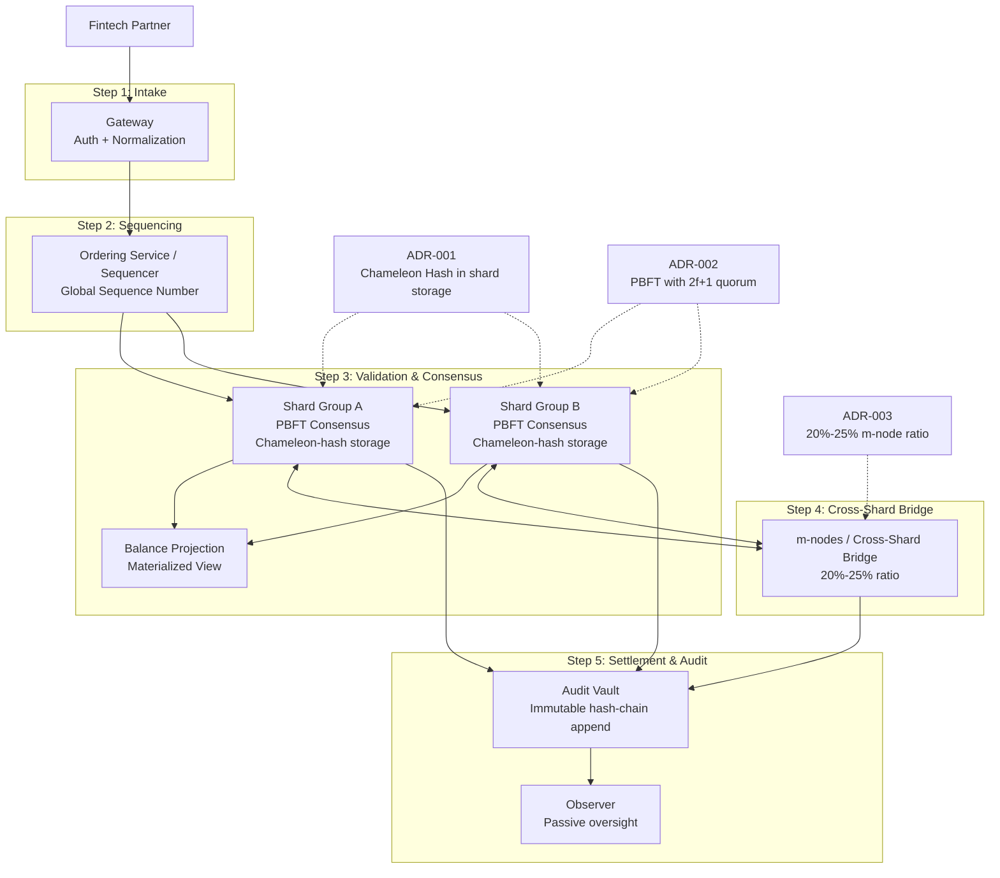

# High-Level Design

## 1. Purpose
This document is the service-level map for the NeoBank Ledger architecture. It grounds the system flow in [[BPA_Report#5.2 To-Be Flow (Event Sourcing + Shards + Fabric-like EOV)|BPA Section 5.2]] and applies the completed ADR stack:
- [[ADR-001-GDPR-Compliance]] for redactable shard storage.
- [[ADR-002-Deterministic-Finality-via-PBFT]] for deterministic finality inside each shard-group.
- [[ADR-003-Sharding-Topology-via-MSSP]] for the m-node-based shard topology.

The design stays at the service boundary level. It shows how a command moves from intake through ordering, validation, projection, and audit logging without describing code-level classes or deployment internals.

## 2. End-to-End Flow

## 3. Service Responsibilities

### Gateway
The Gateway authenticates the Fintech Partner, validates the inbound command shape, and normalizes the payload into the internal transaction event form. It is the only direct ingress path into the ledger.

### Ordering Service / Sequencer
The Sequencer assigns a global sequence number and routes the ordered event batch to the relevant shard-groups. It does not decide finality by itself; it only establishes deterministic ordering before validation.

### Shard Groups
Each shard-group runs PBFT with a $2f+1$ quorum, as defined in [[ADR-002-Deterministic-Finality-via-PBFT]]. The shard-group validates the ordered event, applies conflict checks, and appends the accepted result to shard storage.

The shard storage layer uses the redactable-ledger mechanism from [[ADR-001-GDPR-Compliance]]. Chameleon hashes preserve hash-chain continuity while allowing authorized redaction workflows when legal conditions require it.

### m-nodes / Cross-Shard Bridge
The m-nodes implement the cross-shard bridge. Their 20%-25% ratio, defined in [[ADR-003-Sharding-Topology-via-MSSP]], allows the bridge to participate in multiple consensus zones and carry cross-shard atomicity proofs without introducing a separate 2PC service.

### Balance Projection
The Balance Projection is a materialized view generated as a byproduct of the Validate step. It is updated only from accepted validated events, so it remains a read model rather than an independent source of truth.

### Audit Vault
The Audit Vault receives committed shard outputs and appends them into the immutable hash-chain audit trail. It emits evidence to passive observers but does not alter business state.

### Observer
The Observer consumes audit material in read-only mode to support oversight, evidence review, and compliance monitoring.

## 4. Architecture Integration

- **ADR-001** is applied in the shard storage layer. The HLD assumes chameleon-hash-backed redaction support for authorized PII workflows while preserving hash-chain continuity.
- **ADR-002** is applied inside each shard-group. Validation requires a PBFT quorum of $2f+1$ before an event is accepted as finalized for that shard.
- **ADR-003** is applied in the topology layer. The shard bridge relies on an m-node population of 20%-25% to support cross-shard coordination and reduce the need for heavyweight commit protocols.

## 5. Design Notes

- The flow matches the BPA 5.2 pattern: capture, sequencing, validation, append, materialize, and observe.
- Cross-shard atomicity is handled by the m-node bridge, not by a separate generic transaction coordinator.
- The Balance Projection is intentionally derived from validation results so the world state can be queried without scanning the event log.
- The HLD remains service-level only; detailed entity schemas belong in the next design step.
